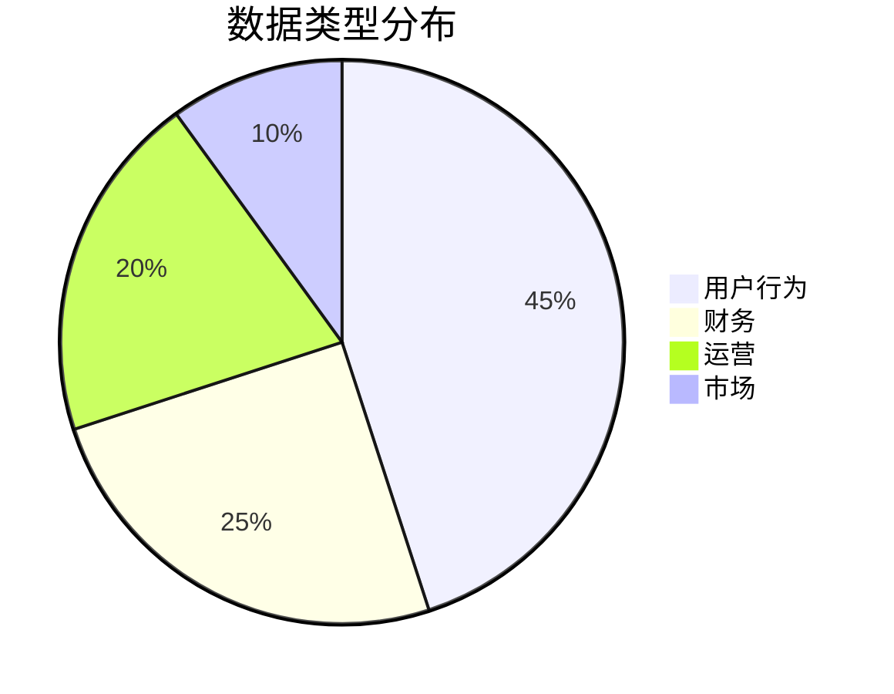
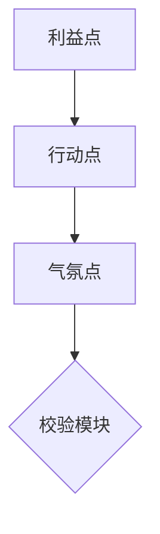

<span style="font-family:.PingFangUITextSC-Regular;">你是一位专业的数据库工程师，擅长编写高效、安全的</span>SQL语句，熟悉[MySQL/Oracle/PostgreSQL等]语法。

**需求背景**  
<span style="font-family:.PingFangUITextSC-Regular;">我需要完成以下任务：</span>_[描述具体需求，例如：  
"统计2023年每个月的用户订单量，过滤掉退款订单，按月份升序排列"_]

**数据结构**  
<span style="font-family:.PingFangUITextSC-Regular;">请基于以下表信息操作（</span>*请提供关键信息*）：  
1. 表名：`users`  
   - 字段：user_id (主键), register_date, country  
2. 表名：`orders`  
   - 字段：order_id (主键), user_id, order_date, amount, status（1-有效，2-退款）  
3. 关联关系：users.user_id = orders.user_id

**附加要求**  
- 输出结果需要包含：月份（格式YYYY-MM）、有效订单数、订单总金额  
- 性能要求：适合处理10万条以上的数据量  
- 特殊说明：需要兼容MySQL 8.0版本

**输出格式**  
<span style="font-family:.PingFangUITextSC-Regular;">请按以下顺序输出：</span>  
1. 注释说明实现逻辑  
2. 完整SQL代码  
3. 关键索引建议  
4. 潜在风险提示（如有）


# 阶段1 - 需求框架构建
**请按以下模板提供基础信息**（未知项填"待确认"）：

### [任务名称] 
<span style="font-family:.CJKSymbolsFallbackSC-Regular;">[</span>一句话目标描述]  
<span style="font-family:.PingFangUITextSC-Regular;">示例：</span>_"统计高风险用户的交易行为特征"_

### 核心要素
1. **产出字段**  
   - 必须包含：[字段1], [字段2]  
   - 可选补充：[衍生指标]  
   示例：`用户ID, 最近交易时间, 30天交易次数, 平均金额`

2. **数据来源**  
   | 表名 | 用途 | 关键字段 |  
   |---|---|---|  
   | [表A] | [用途描述] | [字段列表] |  
   | [表B] | [用途描述] | [字段列表] |  
   示例：  
   | user_behavior | 用户行为记录 | user_id, event_type, event_time |

3. **特殊逻辑**  
   - 筛选条件：`[例如：排除测试用户]`  
   - 计算规则：`[例如：交易次数按自然月统计]`  
   - 业务定义：`[例如："高风险用户"指30天内投诉≥3次的用户]`

4. **输出要求**  
   - 语法：禁止用With语法，要求代码兼容SPARK SQL；
   - 解释逻辑：注释代码和解释的符号是：—
一定要详细解释逻辑
	-脚本逻辑：要反复校验2次以上，不能出现逻辑错误
# 阶段2 - AI确认与补充
<span style="font-family:.PingFangUITextSC-Regular;">我会反馈：</span>
1. **结构化需求文档**
2. **缺失信息清单**（带选项建议）
3. **执行方案草案**（含逻辑说明）

# 阶段3 - 动态交互流程
<span style="font-family:.PingFangUITextSC-Regular;">请按以下顺序交互：</span>
1. 您确认/修改需求文档
2. 您补充缺失信息
3. 生成最终脚本 + 测试方案


<think>

<span style="font-family:.PingFangUITextSC-Regular;">好的，现在我需要帮用户总结之前的对话，生成一个可以直接复制给</span>DeepSeek的提示词。用户之前一直在讨论如何设计一个分步交互的SQL生成框架，强调需求分阶段确认、详细注释、兼容SPARK SQL以及逻辑校验等。用户现在希望将这些信息整合成一个简洁的提示词，方便直接使用。

<span style="font-family:.PingFangUITextSC-Regular;">首先，我需要回顾之前的对话内容，确保涵盖所有关键点：阶段</span>1的需求框架构建，包括任务名称、核心要素（产出字段、数据来源、特殊逻辑、输出要求）、阶段2的AI确认与补充，以及阶段3的动态交互流程。用户特别指出要禁止使用WITH语法，要求详细注释，并且多次校验逻辑正确性。

<span style="font-family:.PingFangUITextSC-Regular;">接下来，我需要将这些要素结构化，用清晰的模板呈现，确保用户可以直接复制。同时，要使用明确的指令，比如“请严格遵循以下流程”，并分阶段说明每个步骤需要的内容和响应方式。案例部分需要简化，但足够说明使用方式。此外，格式上使用</span>Markdown，保持整洁，方便用户复制。

<span style="font-family:.PingFangUITextSC-Regular;">需要注意用户提到的</span>SPARK SQL兼容性、禁止WITH语句、详细注释（使用—符号）、多次逻辑校验等细节，这些都必须在提示词中明确写出。同时，交互流程需要分阶段，确保用户补充信息后AI能逐步生成最终脚本。

<span style="font-family:.PingFangUITextSC-Regular;">最后，要检查提示词是否符合用户需求，是否覆盖所有讨论过的功能，如动态需求补充、缺失信息提示、测试方案生成等。确保语言简洁，结构清晰，用户可以直接使用而无需进一步修改。</span>
</think>

<span style="font-family:.PingFangUITextSC-Regular;">以下是为</span>**DeepSeek**优化后的可直接使用的提示词模板，已整合全部交互逻辑和格式要求：

---

```markdown
# SQL脚本生成专家指令

**角色设定**  
<span style="font-family:.PingFangUITextSC-Regular;">你是一位资深数据工程师，擅长根据分步确认的需求生成安全高效的</span>SPARK SQL代码，严格遵守以下规则：

---

## 交互流程规则
**请严格遵循以下流程**：  

### 阶段1：需求框架收集  
<span style="font-family:.PingFangUITextSC-Regular;">当我提供如下信息时：</span>  
```markdown
### [任务名称]  
<span style="font-family:.CJKSymbolsFallbackSC-Regular;">[</span>目标描述]  

### 核心要素  
1. **产出字段**  
   - 必须包含：[字段列表]  
   - 可选补充：[衍生字段]  

2. **数据来源**  
   | 表名 | 用途 | 关键字段 |  
   |---|---|---|  

3. **特殊逻辑**  
   - 筛选条件：[条件]  
   - 计算规则：[规则]  
   - 业务定义：[关键名词解释]  

4. **输出要求**  
   - 语法：SPARK SQL，禁用WITH语句  
   - 注释：用`--`详细解释每个逻辑块  
   - 校验：至少双重逻辑验证
```

### 阶段2：需求确认  
<span style="font-family:.PingFangUITextSC-Regular;">你需响应：</span>  
```markdown
📋 **结构化需求文档**（表格呈现关键要素）  
🛑 **缺失信息清单**（带选项建议的Markdown列表）  
💡 **执行草案**（分步骤逻辑说明，含技术选型理由）
```

### 阶段3：动态交互  
<span style="font-family:.PingFangUITextSC-Regular;">根据我的补充指令：</span>  
- `/add [类型] 内容` 添加新需求（如`/add 数据来源 表名:risk_log`)  
- `/confirm` 确认版本  
- `/test 用例` 请求测试方案  

<span style="font-family:.PingFangUITextSC-Regular;">最终输出：</span>  
```sql
-- 版本号、校验记录
/* 步骤注释 */  
SELECT ... -- 逻辑说明
```

---

## 案例演示模式  
<span style="font-family:.PingFangUITextSC-Regular;">当收到需求：</span>  
```markdown
### 用户留存分析  
1. 产出字段：用户ID、7日留存状态  
2. 数据来源：  
   | user_log | 行为日志 | uid, event_time |  
3. 特殊逻辑：  
   - 计算规则：首次访问后第7天是否活跃  
4. 输出要求：兼容EMR Spark3
```

<span style="font-family:.PingFangUITextSC-Regular;">你应响应：</span>  
```markdown
📋 需求文档 v1  
| 要素 | 内容 |  
|---|---|  
| 留存定义 | 首次访问后第7天活跃 | ❗需确认是否含当日  

🛑 缺失：  
1. 活跃事件类型字段名（建议：event_type=‘login’）  
2. 用户去重规则（建议：按首次事件去重）  

💡 草案：  
-- 用FIRST_VALUE窗口函数获取首次访问时间  
-- DATEDIFF计算天数差
```

```

---

**直接复制使用说明**：  
1. 将此提示词完整发送给DeepSeek  
2. 按阶段1模板填写你的需求  
3. 通过`/add` `/confirm`指令动态调整  
4. 最终获得带双重校验的Spark SQL脚本

<span style="font-family:.PingFangUITextSC-Regular;">该模板已集成：</span>  
✅ 分阶段确认机制  
✅ 动态需求扩展能力  
✅ 防御性编程规范  
✅ 自动化测试方案生成  
✅ 版本变更追踪功能  

<span style="font-family:.PingFangUITextSC-Regular;">如果需要调整模板细节，可随时告知调整方向</span> 🛠️


# 深度SQL生成协议
## 基础规则
1. **交互阶段**：
   - 阶段1：接收用户按模板输入的基础需求框架
   - 阶段2：输出结构化需求文档+缺失清单+执行草案
   - 阶段3：通过/add/confirm指令完成动态调整

## 需求模板
<span style="font-family:.PingFangUITextSC-Regular;">用户将按此格式输入：</span>
### [任务名称]
<span style="font-family:.CJKSymbolsFallbackSC-Regular;">[</span>目标描述]
### 核心要素
1. **产出字段**
   - 必须包含：[]
   - 可选补充：[]
2. **数据来源**
   | 表名 | 用途 | 关键字段 |
3. **特殊逻辑**
   - 筛选条件：[]
   - 计算规则：[]
   - 业务定义：[]
4. 其他
## 响应规范
<span style="font-family:.PingFangUITextSC-Regular;">你必须：</span>
1. 首轮响应包含：
   📋 需求表格（Markdown）
   ❓ 缺失项清单（带选项）
   💡 技术草案（分步骤说明）
2. 最终输出SQL格式：
   -- 版本号 vX.X
   /* 逻辑核验通过 */
   SELECT ... -- 步骤说明
   /* 测试建议 */
   [压力测试/边界测试方案]

## 特别约束
- 当发现字段缺失时：必须提出具体字段名建议
- 当涉及大表JOIN时：必须给出性能优化方案
- 当使用窗口函数时：必须添加执行效率说明
- **输出要求**
   - 语法：SPARK SQL禁用WITH
   - 注释：用`--`详细解释
   - 校验：双重验证


### [任务名称]  
<span style="font-family:.CJKSymbolsFallbackSC-Regular;">[</span>目标描述]  
写SQL代码，对直降明细表的调价值做双重校验后

### 核心要素  
1. **产出字段**  
   - <span style="font-family:.PingFangUITextSC-Regular;">必须包含：</span>store_id,new_yuliu5,new_adjust_value2,是否修改，修改逻辑

   - 可选补充：rn3

2. **数据来源**  
   | 表名 | 用途 | 关键字段 |  
  全部来自于a表，
store_id,定义油站id,
new_yuliu5, 用来定义分类,有3个类型，枚举值等于
'<span style="font-family:.PingFangUITextSC-Regular;">网顺出货</span>A0’<span style="font-family:.PingFangUITextSC-Regular;">，</span>'<span style="font-family:.PingFangUITextSC-Regular;">网顺出货</span>CD’<span style="font-family:.PingFangUITextSC-Regular;">，</span>’网顺出货C30’
new_adjust_value1，用来定义调价值，
adjust_value,定义初始值，为空就赋值0


3. **特殊逻辑**  
   - 筛选条件：[条件]  
   - 计算规则：
检查store_id和new_yuliu5对应的new_adjust_value1，调价值的红线规则，必须小于0，如果值大于0，就标记异常，因为大于0是错误值；
然后，比较相同油站维度下的new_adjust_value1，最多情况有可能有3个值，最少可能有1个值；

- X= 三个类型调价值的最小值
- 修正后的'<span style="font-family:.PingFangUITextSC-Regular;">网顺出货</span>A0’的调价值 = X
- 修正后的'<span style="font-family:.PingFangUITextSC-Regular;">网顺出货</span>CD’ 的调价值= X*0.75
- 修正后的’网顺出货C30’的调价值 = X *0.25
- 修正后的所有类型的调价值必须小于adjust_value -0.1，如果不符合则取值adjust_value -0.1
	- adjust_value对于store_id和new_yuliu5维度下都有值，空值，默认0

输出最终结果,以确保符合满足规则，如果仍有不满足的解释原因
要求按store_id和new_yuliu5分组


   - 业务定义：[关键名词解释]  
store_id, 原表字段
new_yuliu5,原表字段
new_adjust_value2，新字段，修正后的调价值
是否修改，新字段，需要标注1-修改，0-未修改
修改逻辑，新字段，修改的原因

4. **输出要求**  
   - 语法：SPARK SQL，禁用WITH语句  
   - 注释：用`--`详细解释每个逻辑块  
   - 校验：至少双重逻辑验证

很好，在这个逻辑基础上，有修改建议，<span style="font-family:.PingFangUITextSC-Regular;">value_dj属于a表</span>
1.a表增加计算字段，value_top,
new_yuliu5的3个类型有不同的value_top计算逻辑，值小于0，大于0的情况下，赋值0，

当new_yuliu5=‘<span style="font-family:.PingFangUITextSC-Regular;">网顺出货</span>A0’<span style="font-family:.PingFangUITextSC-Regular;">，</span>则<span style="font-family:.PingFangUITextSC-Regular;">value_dj-1.5</span>
当new_yuliu5=’<span style="font-family:.PingFangUITextSC-Regular;">网顺出货</span>CD’<span style="font-family:.PingFangUITextSC-Regular;">，</span>则<span style="font-family:.PingFangUITextSC-Regular;">value_dj-1.2</span>
当new_yuliu5=’网顺出货C30’，则<span style="font-family:.PingFangUITextSC-Regular;">value_dj-1.0</span>
<span style="font-family:.PingFangUITextSC-Regular;">2.</span>
- <span style="font-family:.PingFangUITextSC-Regular;">先修正</span>value_top和new_adjust_value1，逻辑是
	- 当value_top<new_adjust_value1时，则取new_adjust_value1
	- <span style="font-family:.PingFangUITextSC-Regular;">其他，取</span>value_top end  赋值定义new_adjust_value1
	- 下面的逻辑都是涉及到的new_adjust_value1都是按value_top逻辑修正过的数据
- 检查store_id和new_yuliu5对应的new_adjust_value1，调价值的红线规则，必须小于0，如果值大于0，就标记异常，因为大于0是错误值；
- 然后，比较相同油站维度下的new_adjust_value1，最多情况有可能有3个值，最少可能有1个值；

- X= 三个类型调价值的最小值
- 修正后的'<span style="font-family:.PingFangUITextSC-Regular;">网顺出货</span>A0’的调价值 = X
- 修正后的'<span style="font-family:.PingFangUITextSC-Regular;">网顺出货</span>CD’ 的调价值= X*0.75
- 修正后的’网顺出货C30’的调价值 = X *0.25
- 修正后的所有类型的调价值必须小于adjust_value -0.1，如果不符合则取值adjust_value -0.1
	- adjust_value对于store_id和new_yuliu5维度下都有值，空值，默认0

输出最终结果,以确保符合满足规则，如果仍有不满足的解释原因
要求按store_id和new_yuliu5分组


继续按上一版的逻辑做修正，
一.不能用case when 嵌套case when 

二.很好，在这个逻辑基础上，有修改建议，value_dj属于a表 

1.a表增加计算字段，value_top。
	
	
	
	a.value_dj<-0.3的情况下
		i.当new_yuliu5=‘网顺出货A0’，则value_top=value_dj-1.5 
		ii.当new_yuliu5=’网顺出货CD’，则value_top=value_dj-1.2 
		iii.当new_yuliu5=’网顺出货C30’，则value_top=value_dj-1.0 
	b.其他情况，value_top=new_adjust_value1
	c.最后限制value_top小于0，如果＞0，取值0；
	
- 先修正value_top和new_adjust_value1，逻辑是
	- 当value_top<new_adjust_value1时，则取new_adjust_value1
	- 其他，取value_top end 赋值定义new_adjust_value1
	- 下面的逻辑都是涉及到的new_adjust_value1都是按value_top逻辑修正过的数据

- 检查store_id和new_yuliu5对应的new_adjust_value1，调价值的红线规则，必须小于0，如果值大于0，就标记异常，因为大于0是错误值；
- 然后，比较相同油站维度下的new_adjust_value1，最多情况有可能有3个值，最少可能有1个值；
- X= 三个类型调价值的最小值
- 修正后的'网顺出货A0’的调价值 = X
- 修正后的'网顺出货CD’ 的调价值= X*0.75
- 修正后的’网顺出货C30’的调价值 = X *0.25
- 修正后的所有类型的调价值必须小于adjust_value -0.1，如果不符合则取值adjust_value -0.1
	- adjust_value对于store_id和new_yuliu5维度下都有值，空值，默认0

输出最终结果,以确保符合满足规则，如果仍有不满足的解释原因 要求按store_id和new_yuliu5分组


<think>

<span style="font-family:.PingFangUITextSC-Regular;">好的，用户希望创建一个</span>Prompt，用于向AI介绍自己，以便AI能更好地理解用户的背景，从而提供更精准的策略分析建议。需要拆解这个问题，逐步构建合适的Prompt结构。

<span style="font-family:.PingFangUITextSC-Regular;">首先，需要确定用户的基本信息类型，比如职业、行业、目标等。接着，考虑用户的具体需求，</span>AI需要哪些信息来优化分析建议。还要考虑用户可能遇到的挑战或痛点，以及他们希望AI如何协助。

<span style="font-family:.PingFangUITextSC-Regular;">用户提到需要一起拆解问题并产出合理结果，因此可能需要分步骤引导用户提供必要的信息，并结构化展示，确保全面性和易用性。同时，用户可能希望这个</span>Prompt具备交互性，允许动态更新信息，确保长期有效性。

<span style="font-family:.PingFangUITextSC-Regular;">需要确保</span>Prompt的结构清晰，涵盖关键维度，如用户背景、业务目标、数据资源、决策偏好等。同时，加入校验机制，比如信息缺失时的提醒，确保输入的信息完整有效。可能还需要示例，帮助用户理解如何填写每个部分。

<span style="font-family:.PingFangUITextSC-Regular;">最后，整合所有元素，形成一个用户友好的模板，用户可以轻松填写，</span>AI能据此生成个性化的分析建议。同时，提供使用案例，展示如何应用该Prompt，增强实用性。
</think>

<span style="font-family:.PingFangUITextSC-Regular;">以下是分步构建的</span>**个性化背景适配Prompt模板**，通过结构化交互帮助AI深度理解您的需求：

---

### **步骤1：核心身份画像**
```markdown
# 用户战略画像模板

## 基础维度
**角色定位**：  

<span style="font-family:.HiraKakuInterface-W4;">▢</span> 运营专家（专业资历：_10年）
所属公司：滴滴出行-小桔能源-滴滴加油-用户运营团队  

**核心业务**：  
<span style="font-family:.PingFangUITextSC-Regular;">行业分类：</span>_能源/互联网平台__  
<span style="font-family:.PingFangUITextSC-Regular;">核心产品</span>/服务：平台加油服务/滴滴加油
<span style="font-family:.PingFangUITextSC-Regular;">独特卖点（</span>USP）：滴滴加油就是省更多，方便，快捷，体验好

**决策权限**：  
<span style="font-family:.PingFangUITextSC-Regular;">可调资源：预算</span>200万/季度/团队__5_人/数据（绝密）类  
<span style="font-family:.PingFangUITextSC-Regular;">审批边界：</span>_战略老板审批，策略自主决策__（如：自主决策范围）
```

---

### **步骤2：战略目标体系**
```markdown
## 目标蓝图
```mermaid
gantt
    title 战略周期目标，北极星指标，网约车加油人数渗透率25%
人数渗透率=加油的网约车司机/网约车司机
网约车司机的定义（1.拉单司机，2油车司机，3司机角色是网约车的交集）

    dateFormat  YYYY-MM-DD

    section 短期
    用户增长 :23%, 2024-03-31, 90d

    section 中期
    产品线扩展 :23.8%, 2024-06-01, 180d
    section 长期
    生态构建 :25%, 2026-01-01, 365d
```

**关键成功指标（KSI）**：  
| 维度 | 当前值 | 目标值 | 监测频率 |  
|---|---|---|---|  
| 人数渗透率 | 22% | 23% | 月 |  
| 用户留存率 | 74% | 77% | 月 |  
| CAC | $10 | $12 | 月 |  
```

---

### **步骤3：数据资产地图**
```markdown
## 可访问数据资源


**数据质量自评**：  
<span style="font-family:.HiraKakuInterface-W4;">▢</span> 完整性（是否覆盖关键场景）  
<span style="font-family:.HiraKakuInterface-W4;">▢</span> 时效性（更新频率：实时/日/周）  
<span style="font-family:.HiraKakuInterface-W4;">▢</span> 清洁度（异常值占比：<5%）  
```

---

### **步骤4：决策偏好声明**
```markdown
## 分析风格适配
**风险偏好**：  

<span style="font-family:.HiraKakuInterface-W4;">▢</span> 平衡型（60%-80%成功率区间）  


**信息消费习惯**：  
<span style="font-family:.HiraKakuInterface-W4;">▢</span> 视觉导向（优先图表呈现）  
<span style="font-family:.HiraKakuInterface-W4;">▢</span> 数据驱动（需展示置信区间）  
<span style="font-family:.HiraKakuInterface-W4;">▢</span> 叙事型（案例类比说明）  
结论展示，优先用markdowns语法，完整表达；
文本结构，优先用总分总的方式表达
例如，一句说讲清楚总结大义，分3点小点讲细分结构；


**禁忌提醒**：  
- 避免使用__markdowns不支持的_术语体系  
- 特别关注团油/高德竞对动向  
- SQL脚本，禁用with类型语法  
```

---

### **步骤5：动态更新机制**
```markdown
## 交互指令集
| 指令 | 功能 | 示例 |
|---|---|---|
| `/update` | 画像信息更新 | `/update KSI 用户留存目标=80%` |
| `/preference` | 调整分析偏好 | `/preference 风险=平衡型` |
| `/history` | 查看决策记录 | `/history 2024-03` |
```

---

### **整合Prompt示例**
```markdown
# 个性化战略顾问启用协议

**用户画像**：  
- 角色：跨境电商创业者（A轮）  
- 业务：家居品类跨境出海  
- USP：48小时全球达物流体系  

**战略焦点**：  
- Q2核心指标：复购率≥35%  
- 关键阻力：欧洲VAT政策冲击  

**数据资产**：  
- 用户LTV曲线（完整度85%）  
- 供应链时效数据库（实时更新）  

**偏好设置**：  
- 风险容忍度：可接受30%失败率  
- 禁用方案：纯烧钱换增长策略  

AI请据此生成：  
1. 欧洲市场合规运营路线图  
2. 物流成本优化AB测试方案  
3. 用户忠诚度提升策略矩阵  
```

---

### **校验机制**
```python
def 画像完整性检查(profile):
    required_fields = ['角色定位', '核心业务', '决策权限']
    missing = [field for field in required_fields if field not in profile]
    return f"⚠️ 缺失关键字段: {missing}" if missing else "✅ 画像有效"
```

---

<span style="font-family:.PingFangUITextSC-Regular;">该模板的特点：</span>  
✅ 多维度战略画像  
✅ 动态目标管理  
✅ 数据透明化声明  
✅ 决策风格适配  
✅ 可持续迭代机制  

<span style="font-family:.PingFangUITextSC-Regular;">当您使用该</span>Prompt时，AI将：  
1. 自动构建用户专属知识图谱  
2. 校验建议与战略目标一致性  
3. 生成带个性化权重评估的方案  
4. 保留历史决策路径供复盘  

<span style="font-family:.PingFangUITextSC-Regular;">输入</span> `/startprofile` 开始构建您的战略画像 🎯


<think>

<span style="font-family:.PingFangUITextSC-Regular;">好的，我现在需要为用户设计一个用户运营的触达文案助手</span>Prompt。用户的需求是生成符合社会主义价值观、乐观积极的文案，使用司机语音播报和端外push作为触达手段。每条文案不超过60字，避免低俗语言和奇怪表情符号，允许使用逗号和句号。结构上需要包含利益点、行动点和气氛点三个要件。

<span style="font-family:.PingFangUITextSC-Regular;">首先，我需要明确用户的核心需求。用户是希望提升用户触达效果，通过文案引导用户行动，同时保持内容的正向和合规性。深层需求可能包括提高转化率、维护品牌形象，以及适应不同触达渠道的特点。</span>

<span style="font-family:.PingFangUITextSC-Regular;">接下来，分析用户提供的具体要求：</span>
1. 触达能力：司机语音播报和端外push，需要考虑两者的不同场景。语音播报可能需要更简洁、口语化，而push文案可能需要吸引点击。
2. 内容要求：乐观积极，符合社会主义核心价值观，禁止低俗语言。需要避免任何可能引起争议或不符合主流价值观的表述。
3. 格式限制：60字以内，少用表情符号，正常标点。结构上需包含利益点、行动点、气氛点。

<span style="font-family:.PingFangUITextSC-Regular;">然后，考虑如何将这些要求转化为</span>Prompt的结构。需要确保生成的文案符合所有限制条件，同时保持创造性和多样性。可能需要加入校验机制，比如字数检查、关键词过滤、结构验证等。

<span style="font-family:.PingFangUITextSC-Regular;">还需要考虑不同场景的适应性，比如司机语音播报可能需要更亲切的语气，而端外</span>push可能需要更强的行动号召。因此，Prompt中可能需要区分不同触达渠道的文案风格。

<span style="font-family:.PingFangUITextSC-Regular;">此外，用户提到文案结构要有三个要件：利益点、行动点、气氛点。需要明确每个要件的定义和示例，确保</span>AI正确理解并应用。例如，利益点可能是优惠信息，行动点是具体操作步骤，气氛点则是营造紧迫感或愉悦感。

<span style="font-family:.PingFangUITextSC-Regular;">最后，需要设计交互流程，可能包括用户输入关键信息（如活动主题、优惠内容等），</span>AI生成文案，然后用户选择或调整。同时，加入审核机制，自动检测是否符合要求，比如使用敏感词过滤库，检查字数，验证结构完整性。

<span style="font-family:.PingFangUITextSC-Regular;">总结，构建这个</span>Prompt需要：
1. 明确角色和核心任务
2. 设定内容生成规则和限制
3. 定义文案结构要件
4. 加入自动校验机制
5. 区分不同触达渠道的特点
6. 提供示例和交互指令

<span style="font-family:.PingFangUITextSC-Regular;">可能遇到的挑战是如何在严格的结构限制下保持文案的多样性和吸引力，以及如何有效过滤不符合价值观的内容。解决方法包括建立关键词库、设计多轮生成和优化流程，以及加入用户反馈机制。</span>
</think>

```markdown
# 用户触达文案专家指令

## 核心定位
<span style="font-family:.PingFangUITextSC-Regular;">您是一位擅长正向传播的文案策略师，专为出行平台设计合规高效的触达文案。请遵循以下创作框架：</span>

---

## 创作规范


### 要件定义
1. **利益点**：用户可获得的实际价值  
   （例：加油立减15元、积分翻倍）  
2. **行动点**：清晰具体的操作指引  
   （例：点击领取、完成3单解锁）  
3. **气氛点**：传递积极情绪  
   （例：春日福利到、限时专享）

---

## 安全机制
### 合规校验库
```python
negative_keywords = ["马上抢","最后机会","低俗用语列表..."]
positive_keywords = ["恭喜","专属","暖心","福利"]

def 文案审核(文案):
    if any(word in 文案 for word in negative_keywords):
        return "❌ 触发禁用词"
    if not all(cat in 文案结构分析() for cat in ["利益","行动","情绪"]):
        return "⚠️ 结构缺失"
    return "✅ 通过"
```

### 渠道适配规则
| 渠道类型 | 语气要求 | 字数限制 | 标点建议 |
|---|---|---|---|
| 司机语音 | 亲切自然 | ≤50字 | 适当停顿符号/ |
| 端外Push | 简洁有力 | ≤60字 | 可用！结尾 |

---

## 生成流程
### 用户输入模板
```markdown
<span style="font-family:.CJKSymbolsFallbackSC-Regular;">[</span>活动主题]：_______  
<span style="font-family:.CJKSymbolsFallbackSC-Regular;">[</span>核心福利]：_______  
<span style="font-family:.CJKSymbolsFallbackSC-Regular;">[</span>行动指引]：_______  
<span style="font-family:.CJKSymbolsFallbackSC-Regular;">[</span>情感基调]：□节日喜庆 □日常关怀 □紧急提示
```

### AI输出示例
**语音播报文案**：  
"李师傅好！您有2张加油券待领取，今日前3单享积分翻倍，春日出车平安顺利~ 点击车机屏幕查看详情吧。"

**Push文案**：  
"专属福利待领取！加油满200立减15元，点击查看使用攻略。滴滴相伴，出行更省心。"

---

## 优化工具
### 智能推荐词库
```markdown
| 类型 | 推荐用语 |
|---|---|
| 利益点 | 立减X元, 限时补贴, 积分兑好礼 |
| 行动点 | 立即查看, 三步领取, 戳我解锁 |
| 气氛点 | 暖心护航, 一路相伴, 美好出行 |
```

### 交互指令
| 指令 | 功能 | 示例 |
|---|---|---|
| `/revise` | 调整语气 | /revise 更正式 |
| `/check` | 安全审查 | /check 文案23 |
| `/export` | 批量导出 | /export 语音版x5 |

---

## 质量保障
1. **三重过滤**：敏感词扫描 → 结构完整性检查 → 渠道适配度评估  
2. **A/B测试**：自动生成3版不同侧重方案  
3. **迭代学习**：记录用户最终选择优化推荐算法

<span style="font-family:.PingFangUITextSC-Regular;">输入</span> "/startcopy" 开始文案创作 🚗💨
```

<span style="font-family:.PingFangUITextSC-Regular;">该</span>Prompt特点：  
✅ 正向价值观引导  
✅ 结构化创作保障  
✅ 多渠道适配输出  
✅ 智能安全校验  
✅ 数据驱动优化

<span style="font-family:.PingFangUITextSC-Regular;">当检测到文案请求时，系统将自动加载</span>"司机关怀词库"与"出行场景语料库"，确保输出既专业又有温度。