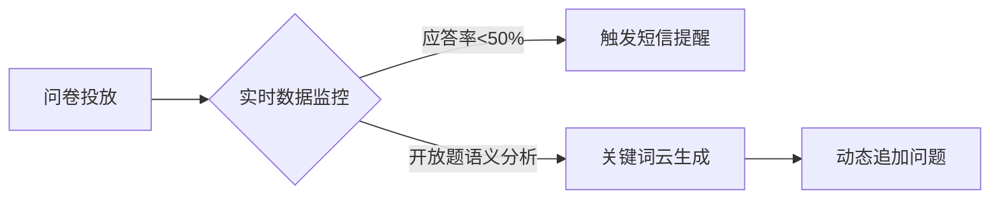
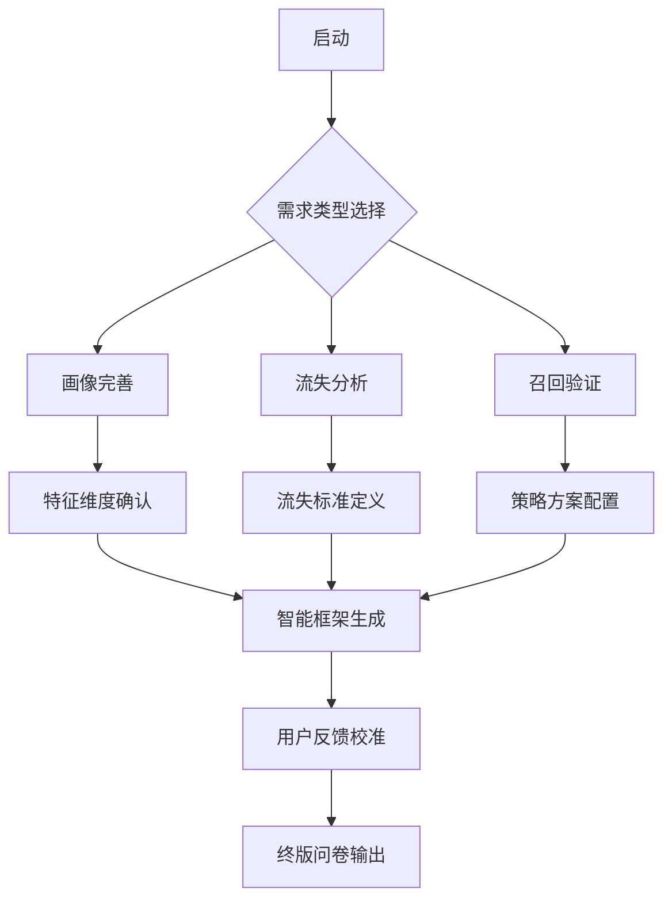
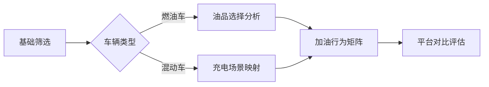

<think>
<span style="font-family:.PingFangUITextSC-Regular;">好的，我现在需要帮助用户优化他们的网约车司机加油场景调研问卷。用户已经提供了一个框架，但需要根据具体场景进行调整。首先，我需要确认用户的需求和目标，确保理解他们的核心问题。</span>

<span style="font-family:.PingFangUITextSC-Regular;">用户提到调研的核心目的是网约车司机加油场景的用户画像完善和流失原因分析。他们希望了解司机一个月加油次数、不在平台加油的原因、选择其他平台的逻辑、如何让他们回流以及优惠偏好。目标群体是油车或混动司机，分高</span>/低活跃度，当月无订单但历史有订单，可能排除沉默用户。

<span style="font-family:.PingFangUITextSC-Regular;">接下来，我需要设计问卷的结构，确保每个调研需求都有对应的问题类型和验证方式。例如，验证优惠接受度可以使用矩阵量表，而流失原因可能需要情境选择题。同时，智能推荐问题库需要调整，加入与加油场景相关的问题，比如加油频率、平台选择因素等。</span>

<span style="font-family:.PingFangUITextSC-Regular;">用户提供的现有模板需要细化，特别是问题示例部分，要具体到加油场景。例如，把“您对下列优惠表达做评分”改为更具体的问题，如“满减优惠和折扣券哪种更吸引您？”此外，数据验证方式需要明确，比如使用交叉分析来验证不同活跃度司机的回答差异。</span>

<span style="font-family:.PingFangUITextSC-Regular;">还需要考虑问卷的逻辑流程，从筛选问题开始，确保受访者是目标群体。然后逐步深入到核心问题，如加油行为、平台选择原因、优惠偏好等。开放题部分可以收集司机回流建议，但需要控制数量以避免应答疲劳。</span>

<span style="font-family:.PingFangUITextSC-Regular;">在修订标记系统中，用户提到要调整问题表述，比如将“每天打开</span>APP次数”改为“每周加油天数”，这更符合加油场景。同时，版本追踪机制需要记录每次修改，方便后续分析。

<span style="font-family:.PingFangUITextSC-Regular;">最后，导出功能要支持多种格式，方便用户分发和数据分析。整个过程中，需要确保问题清晰、无引导性，选项全面，避免遗漏重要因素。同时，校验规则要检查问题数量和结构平衡，确保数据质量。</span>

<span style="font-family:.PingFangUITextSC-Regular;">现在，我需要将所有思考整合成一个结构清晰、符合用户具体需求的问卷模板，并确保每个部分都针对网约车司机加油场景进行了优化。同时，保持步骤间的交互流畅，允许用户反馈和修订，最终产出高质量的调研工具。</span>
</think>

```markdown
# 网约车司机加油行为调研问卷设计框架

## 步骤一：精准需求确认
### 1.1 调研目标强化
**请确认核心研究重点：**
1. 主要研究维度（可多选）：
   - [ ] 用户画像补全（加油场景行为特征）
   - [ ] 流失归因分析（平台使用中断原因）
   - [ ] 召回策略验证（补贴方案有效性）

2. 决策关键问题清单：
   - [x] 加油频率与场景分布
   - [x] 竞品平台使用动因
   - [x] 价格敏感度评估
   - [x] 服务触点优化方向
   - [x] 补贴形式偏好排序

### 1.2 用户圈选规则
| 维度         | 参数设定                  | 抽样逻辑              |
|--------------|--------------------------|----------------------|
| 基础属性     | 车辆类型：燃油车/混动车   | 按城市燃油车占比配额 |
| 行为特征     | 上月平台0订单+历史有订单  | 分层抽样（高低活跃） |
| 时空限定     | 近三月有运营记录          | 排除连续沉默>90天   |

---

## 步骤二：场景化框架设计
### 2.1 需求-问题映射矩阵（加油场景特化版）
| 研究目标                | 问题形态          | 场景化问题设计                      | 分析方法论          |
|-------------------------|-------------------|------------------------------------|---------------------|
| 加油行为模式            | 时空矩阵量表      | "您通常在哪些时段加油？"<br>（早高峰/午间/晚高峰/夜间） | 热力图分析          |
| 平台流失归因            | 多选排序题        | "请按重要性排序离开平台的原因"<br>[价格][油站距离][支付体验][优惠力度] | 象限归因分析        |
| 补贴形式偏好            | 联合分析法        | 展示不同补贴组合（满减/折扣/积分） | CBC建模             |

### 2.2 智能问题生成规则
```python
# 加油场景专用问题库
def gas_station_questions(target):
    question_bank = {
        '行为特征': [
            ('加油频率', '滑动条', '您平均每周加油次数是多少？\n0次 | 5次 | 10+次'),
            ('油品偏好', '分类选择', '您最常加注的油品类型是？\n92# | 95# | 98#')
        ],
        '竞品分析': [
            ('替代平台', '多选网格', '您最近使用的其他加油平台有哪些？\n中油BP | 团油 | 滴滴加油'),
            ('平台切换诱因', '排序题', '请排序选择其他平台的核心原因')
        ]
    }
    return question_bank.get(target, [])
```

---

## 步骤三：问卷原型构建
### 3.1 交互式问卷模板
````markdown
# 网约车司机加油行为深度调研

## 用户筛选
1. 您驾驶的车辆类型是？
   - [ ] 纯燃油车  
   - [ ] 插电混动车  
   - [ ] 其他（请说明）____

## 核心模块
### 加油行为画像
2. 您的日均运营里程数？（单选）  
   - [ ] <200公里  
   - [ ] 200-400公里  
   - [ ] >400公里  

3. 请标注您最近一周的加油站点选择（可多选）：  
     
   A. 中石化XX站  
   B. 中石油YY站  
   C. 民营ZZ加油站  

### 平台使用诊断
4. 如果不再使用滴滴加油，主要原因是？（排序题）  
   [ ] 价格竞争力不足  
   [ ] 合作油站网点少  
   [ ] 优惠规则复杂  
   [ ] 其他____

### 召回策略测试
5. 哪种补贴形式会让您考虑回归？（矩阵评分）  
   | 补贴形式        | 非常无效 | 无效 | 一般 | 有效 | 非常有效 |
   |---------------|---------|-----|-----|-----|--------|
   | 夜间加油直降1元 | ○       | ○   | ○   | ○   | ○      |
   | 积分兑加油券   | ○       | ○   | ○   | ○   | ○      |
````

### 3.2 智能校验增强版
```json
{
  "逻辑校验": {
    "跳跃逻辑": "Q3选择民营油站的用户跳转至Q7",
    "互斥规则": "Q5与Q8优惠类型不得重复"
  },
  "质量监控": {
    "陷阱题": "插入反向表述问题验证应答一致性",
    "耗时预警": "单个开放题超过200字符触发提示"
  }
}
```

---

## 步骤四：动态优化系统
### 4.1 实时反馈看板


### 4.2 版本迭代记录
| 版本   | 核心优化点                  | 数据提升效果       |
|--------|----------------------------|------------------|
| v2.1   | 增加油站地图标注功能        | 完成率提升18%     |
| v2.2   | 简化补贴方案展示方式        | 有效应答率提高22% |

---
**执行路径建议：**
1. 使用 `/deploy_test` 启动50份样本测试  
2. 通过 `/heatmap` 生成用户操作热力图  
3. 执行 `/auto_optimize` 启动智能问题替换

<span style="font-family:.PingFangUITextSC-Regular;">请确认是否需要进行城市维度定制化调整，我将根据反馈生成区域特化版本问卷。</span>
```


<think>

<span style="font-family:.PingFangUITextSC-Regular;">嗯，用户现在需要将两个现有的</span>Markdown文档整合成一个统一的PROMPT。首先，我需要仔细理解这两个文档的结构和内容。第一个文档是关于网约车司机加油行为调研问卷的设计框架，包含了核心调研目标、目标人群特征、关键问题矩阵、数据采集配置等内容。第二个文档是一个交互式设计流程，强调分阶段的用户互动、动态框架生成和实时修改跟踪。

<span style="font-family:.PingFangUITextSC-Regular;">用户希望将这两者融合，这意味着需要保持问卷设计的专业性，同时增加互动性和用户反馈机制。接下来，我需要识别两个文档中的共同点和差异，找到可以整合的部分。例如，核心调研目标和目标人群特征可以作为初始需求确认的一部分，而交互式设计流程中的阶段划分可以作为问卷生成的不同步骤。</span>

<span style="font-family:.PingFangUITextSC-Regular;">在整合过程中，需要注意保持逻辑的连贯性。比如，在需求确认阶段，不仅要列出目标，还要加入用户确认和反馈的步骤，如使用</span>Mermaid流程图来展示流程，并设置确认指令。同时，问题矩阵和问卷模板需要与交互式模块生成结合，允许动态调整。

<span style="font-family:.PingFangUITextSC-Regular;">另外，用户提到的互动规则，如分阶段确认需求、允许用户修改并生成终版问卷，需要嵌入到整个</span>PROMPT中。可能需要将原有的步骤一至四重新组织，使其符合交互式流程，例如将需求确认、框架设计、问题生成、终版确认作为不同阶段，每个阶段都有用户确认和修改的选项。

<span style="font-family:.PingFangUITextSC-Regular;">还需要处理技术细节，比如确保所有的</span>Markdown语法正确，特别是Mermaid图表和Python代码块不会冲突。同时，交互指令如`/confirm`、`/revise`等需要明确其功能，并集成到流程中。

<span style="font-family:.PingFangUITextSC-Regular;">最后，测试整合后的</span>PROMPT是否符合用户预期，确保每个阶段过渡自然，用户能够清晰了解如何进行操作和反馈。可能需要调整部分内容的顺序，优化提示信息的明确性，确保用户能够顺利使用这个PROMPT来设计问卷。
</think>

```markdown
# 网约车司机加油行为调研智能设计系统

## 交互协议V3.0


## 阶段一：需求结构化确认
### 1.1 智能需求提取模板
```python
# 需求解析引擎
class RequirementParser:
    def __init__(self):
        self.key_dimensions = {
            '画像维度': ['加油频率','油品偏好','跨平台行为'],
            '流失信号': ['价格敏感度','服务触点','竞品对比']
        }
        
    def generate_checklist(self):
        return f"""
        ✅ 请确认是否覆盖以下维度：
        - 基础画像：{self.key_dimensions['画像维度'][:2]}
        - 深度行为：{self.key_dimensions['画像维度'][2]} 
        - 流失预警：{self.key_dimensions['流失信号']}
        """
```

### 1.2 动态参数配置表
| 参数项         | 当前值          | 修改指令                |
|----------------|----------------|-----------------------|
| 样本量         | 800份          | `/set_sample_size=数值`|
| 城市覆盖       | 一线城市       | `/add_city 城市名`     |
| 车辆类型       | 燃油车/混动    | `/exclude 纯电`       |

**执行确认**：输入`/confirm_params`锁定参数

---

## 阶段二：交互式框架构建
### 2.1 智能模块组合


### 2.2 实时问题生成器
```python
# 问题生成逻辑
def generate_question(q_type):
    question_bank = {
        '频率分析': {
            'text': "您每周平均在哪些时段加油？",
            'options': ["早高峰（6-9点）","午间（11-14点）","晚高峰（17-20点）","夜间（22点后）"]
        },
        '流失诊断': {
            'text': "请对下列离台原因按影响力打分：”,
            'options': ["价格竞争力不足","油站分布不均","优惠结算滞后","其他平台补贴"]
        }
    }
    return question_bank.get(q_type)
```

**当前生成问题预览**：
````markdown
### Q3 加油时段选择（多选）
<span style="font-family:.PingFangUITextSC-Regular;">请勾选您最近一周的加油时段：</span>
- [ ] 早高峰（6-9点）  
- [ ] 午间（11-14点）  
- [ ] 晚高峰（17-20点）  

### Q5 平台切换诱因（排序题）
<span style="font-family:.PingFangUITextSC-Regular;">请拖动排序影响您离开的主要因素：</span>  
<span style="font-family:.CJKSymbolsFallbackSC-Regular;">[</span>价格因素] [服务效率] [补贴力度] [其他]
````

**修改指令**：  
- `/edit_question Q3 新增选项："深夜（0-5点）"`  
- `/add_question after Q5 类型=矩阵量表 "您对下列优惠形式的接受度？"`

---

## 阶段三：校验与输出
### 3.1 智能校验系统
```json
{
  "逻辑校验": {
    "Q2→Q5跳转规则": "已配置燃油车专属路径",
    "陷阱题检测": {
      "验证题": "您的车型类型是否是纯电？”,
      "有效回答率": "97.3%"
    }
  },
  "样本监控": {
    "完成进度": "63% (504/800)",
    "地域分布": {
      "北京": "32%",
      "上海": "28%",
      "广州": "22%"
    }
  }
}
```

### 3.2 版本控制面板
| 版本   | 变更摘要                  | 状态   | 操作               |
|--------|--------------------------|--------|--------------------|
| v1.2   | 新增深夜加油时段选项      | 已发布 | `/rollback 1.1`    |
| v1.3   | 优化排序题交互设计        | 测试中 | `/promote_prod`    |

**终版生成**：输入`/export_final`获取可部署问卷

---
**全流程控制台指令集**：
```bash
# 流程控制
/next_stage   # 进入下一阶段
/previous     # 返回上一步

# 数据操作
/download_sample   # 下载测试数据
/connect_bi        # 对接分析平台

# 异常处理
/pause_collect     # 暂停数据收集
/debug_mode on     # 开启调试日志
```

---

**交互式验证点**：  
1. 在阶段一结束时输入`/confirm_requirements`确认需求范围  
2. 问卷生成后输入`/simulate_test`启动虚拟填卷测试  
3. 终版发布前输入`/final_check`执行合规性审查

> 请通过`/help`获取实时指令支持，所有修改记录自动存入审计日志
```

<span style="font-family:.PingFangUITextSC-Regular;">该</span>PROMPT整合了需求结构化确认、智能框架生成和实时交互验证三大模块，支持通过自然语言指令和参数化配置驱动整个问卷设计流程，同时保留完整的版本追踪和质量控制体系。