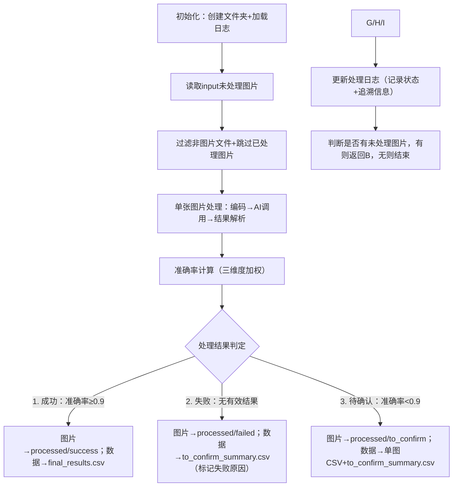

# 油站图片自动化处理工作流需求文档
## 一、项目目标
实现油站图片的**全流程自动化处理**，输出结构化油站数据（含核心业务信息），同时确保数据可追溯、处理状态清晰，仅需少量人工介入校验，最终形成“待处理-已处理-交付”的闭环流程，满足后续数据查询与使用需求。


## 二、核心约束与共识
1. **文件夹切割原则**：`input` 文件夹仅存放“未处理”图片，所有“已处理”图片（无论结果）必须从 `input` 移出，实现“待处理”与“已处理”完全隔离。
2. **重复处理防护**：通过日志记录已处理图片的文件名，程序自动跳过重复处理的图片。
3. **数据可追溯**：每一条油站数据需绑定“源头图片-处理过程-当前位置”信息，支持全链路追溯。
4. **准确率阈值**：AI处理结果准确率≥0.9视为“可信数据”，<0.9或处理失败需人工校验。


## 三、文件夹结构设计（程序自动创建）
| 文件夹路径                          | 用途说明                                                                 | 数据类型                |
|-------------------------------------|--------------------------------------------------------------------------|-------------------------|
| `input/`                            | 未处理油站图片入口（仅存放待处理图片，程序从这里读取）                   | 原始图片（.jpg/.png等） |
| `output/`                           | 所有处理结果的根目录                                                     | -                       |
| ├─ `processed/`                     | 已处理图片的分类存放目录（从`input`移出后存放）                           | 处理后图片              |
| │  ├─ `success/`                    | 处理成功（准确率≥0.9）的图片                                             | 已处理图片              |
| │  ├─ `failed/`                     | 处理失败（无有效结果）的图片                                             | 已处理图片              |
| │  └─ `to_confirm/`                 | 准确率<0.9（需人工校验）的图片                                           | 已处理图片              |
| ├─ `results/`                       | 最终交付的可信结果目录                                                   | 结构化数据文件          |
| │  └─ `final_results.csv`           | 处理成功（准确率≥0.9）的油站数据汇总（含业务字段+追溯字段）               | CSV文件                 |
| ├─ `to_confirm/`                    | 待人工校验的结果目录                                                     | 结构化数据文件          |
| │  ├─ `[图片名]_result.csv`         | 单张图片的待确认数据（含业务字段+追溯字段，标注问题原因）                 | CSV文件                 |
| │  └─ `to_confirm_summary.csv`      | 待确认数据汇总（含失败数据+低准确率数据，统一标注状态与原因）             | CSV文件                 |
| └─ `intermediate/`                  | 中间数据与日志目录（用于追溯与问题排查）                                 | 日志/原始数据文件       |
|    ├─ `raw_json/`                   | AI返回的原始JSON数据（按图片名命名，便于核对）                           | JSON文件                |
|    └─ `processing_log.csv`          | 全量处理日志（记录每张图片的处理状态、时间、准确率、错误原因等）           | CSV文件                 |


## 四、核心处理流程（自动化执行）
### 1. 流程总览


### 2. 关键环节定义
#### （1）准确率计算规则（满分为1.0）
| 评估维度       | 权重 | 合格标准（单条油站数据）                                                                 | 得分计算方式                                                                 |
|----------------|------|------------------------------------------------------------------------------------------|------------------------------------------------------------------------------|
| 字段完整性     | 0.4  | 必选业务字段无缺失（必选字段：城市、油站名称、油站地址、优惠价格、油站价）               | （必选字段合格数 / 5）× 0.4<br>例：5个必选字段全有→0.4分；缺1个→0.32分       |
| 格式正确性     | 0.3  | 数值字段格式正确（距离/优惠价格/油站价为纯数字，无单位/乱码，如“18.02”正确，“18km”错误） | （数值字段合格数 / 3）× 0.3<br>例：3个数值字段全对→0.3分；错1个→0.2分       |
| 逻辑一致性     | 0.3  | 满足3条逻辑规则：<br>① 优惠价格 ≤ 油站价<br>② 距离 ≥ 0<br>③ 日期格式为“YYYY-MM-DD”     | （满足规则数 / 3）× 0.3<br>例：满足2条→0.2分；全满足→0.3分                   |

#### （2）处理结果判定标准
| 处理结果类型 | 判定条件                                                                 | 后续操作                                                                 |
|--------------|--------------------------------------------------------------------------|--------------------------------------------------------------------------|
| 成功         | AI返回有效油站数据，且单图所有油站数据的平均准确率≥0.9                   | 图片移至`processed/success`，数据写入`final_results.csv`                 |
| 失败         | 满足以下任一：<br>① AI调用失败（API超时/密钥错误）<br>② 结果无法解析（非JSON/乱码）<br>③ 无油站数据（AI未识别到油站） | 图片移至`processed/failed`，数据写入`to_confirm_summary.csv`（标记失败原因） |
| 待确认       | AI返回有效油站数据，但单图所有油站数据的平均准确率<0.9                   | 图片移至`processed/to_confirm`，数据写入单图CSV+汇总表（标记低准确率原因） |


## 五、数据字段设计（业务+追溯合并）
每一条油站数据（无论成功/待确认/失败）均包含**核心业务字段**与**追溯字段**，合并在同一条数据行中，无需跨表查询。

### 1. 核心业务字段（用户需求关键信息）
| 字段名  | 数据类型 | 示例值           | 说明                            |
| ---- | ---- | ------------- | ----------------------------- |
| 日期   | 字符串  | "2025-09-15"  | 优先取图片中日期，无则用图片创建日期            |
| 城市   | 字符串  | "北京市"         | 取图片中出现次数最多的城市名，无则填“未知”        |
| 油站名称 | 字符串  | "中石油朝阳站"      | AI识别的油站名称，无则填“未知”             |
| 油站地址 | 字符串  | "朝阳区建国路88号"   | AI识别的详细地址，无则填“未知”             |
| 距离   | 字符串  | "18.02"       | 仅纯数字（默认单位KM），无则填“未知”          |
| 优惠价格 | 字符串  | "7.58"        | 仅纯数字（默认单位元/L，大字体价格），无则填“未知”   |
| 油站价  | 字符串  | "7.88"        | 仅纯数字（默认单位元/L），无则填“未知”         |
| 营销策略 | 字符串  | "满200前10升享折扣" | AI识别的营销活动，无则填“未知”             |
| 优惠信息 | 字符串  | "满200减14"     | AI识别的具体优惠，无则填“未知”             |
| 是否新站 | 字符串  | "否"           | 有“新站”角标填“新站”，无则填“否”，无法识别填“未知” |

### 2. 追溯字段（全链路可追溯）
| 字段名                        | 数据类型 | 示例值                                                                               | 说明                        |
| -------------------------- | ---- | --------------------------------------------------------------------------------- | ------------------------- |
| data_id                    | 字符串  | "oil_station_20250915_001_001"                                                    | 数据唯一ID（图片名_油站序号），用于精准定位数据 |
| source_image_filename      | 字符串  | "oil_station_20250915_001.jpg"                                                    | 原始图片文件名（源头标识）             |
| source_image_original_path | 字符串  | "E:\git_rep\brand-ocr\data\input\oil_station_20250915_001.jpg"                    | 原始图片在`input`中的路径（避免文件名重复） |
| processed_image_path       | 字符串  | "E:\git_rep\brand-ocr\data\output\processed\success\oil_station_20250915_001.jpg" | 处理后图片的最终路径（直接定位图片）        |
| clean_status               | 字符串  | "成功" / "失败" / "待确认"                                                               | 处理状态（核心分类标识）              |
| clean_accuracy             | 数值   | 0.95 / 0 / 0.8                                                                    | 准确率得分（失败为0，成功/待确认为具体分数）   |
| clean_remark               | 字符串  | "无异常" / "API超时，未返回数据" / "缺营销策略字段，准确率不足0.9"                                        | 处理备注（记录问题原因或无异常说明）        |
| process_time               | 字符串  | "2025-09-15 14:30:22"                                                             | 处理时间（精确到秒，便于追溯时序）         |


## 六、人工介入环节（仅2个场景）
| 介入场景               | 操作内容                                                                 | 操作位置                                                                 |
|------------------------|--------------------------------------------------------------------------|--------------------------------------------------------------------------|
| 1. 待确认结果校验补全  | ① 查看`to_confirm/`下的单图CSV或汇总表，修正错误数据（如补充“营销策略”）；<br>② 对处理失败的图片，重新运行程序（自动重试）或替换图片 | ① `to_confirm/[图片名]_result.csv`；<br>② `processed/failed/`（失败图片） |
| 2. 最终结果合并        | 将人工修正后的待确认数据，手动追加到`results/final_results.csv`中，形成完整交付数据 | ① `to_confirm/to_confirm_summary.csv`（修正后数据）；<br>② `results/final_results.csv`（最终交付表） |


## 七、最终交付物
| 交付物路径                          | 用途                                                                 | 受众/使用场景                                                           |
|-------------------------------------|----------------------------------------------------------------------|--------------------------------------------------------------------------|
| `output/results/final_results.csv`   | 处理成功的可信油站数据（含业务+追溯字段）                             | 最终数据使用者（直接用于分析/系统导入）                                  |
| `output/to_confirm/to_confirm_summary.csv` | 待人工校验的所有数据（含失败+低准确率数据，标注问题原因）             | 人工校验人员（快速定位需修正的数据）                                    |
| `output/intermediate/processing_log.csv` | 全量处理日志（记录所有图片的处理状态与细节）                           | 运维/技术人员（问题排查、流程追溯）                                      |
| `output/processed/`下所有图片        | 已处理的分类图片（按成功/失败/待确认存放）                             | 人工校验人员（核对数据与图片的一致性）                                  |


## 八、关键风险与应对
| 风险点               | 应对措施                                                                 |
|----------------------|--------------------------------------------------------------------------|
| AI调用超时/失败      | 程序内置重试机制（最多重试2次，指数退避等待），失败后标记“API超时”并移至`processed/failed` |
| 图片文件名重复       | 追溯字段中记录原始路径+数据唯一ID（`data_id`），避免混淆                 |
| 人工校验后数据遗漏   | 待确认汇总表标注“是否已修正”字段（人工补充），确保修正后的数据不遗漏      |


#附件 #标签 #TY #ORC

## 附件

oil_station_extractor.py

## 额外问答

#### 关于“input文件夹读取范围”及“交付强依赖点”的补充确认
## 一、input文件夹图片读取范围：支持穿透子文件夹（符合你的预期）
### 1. 实现逻辑：递归穿透所有子文件夹读取图片
按你的预期设计：程序会**递归遍历input文件夹下的所有子文件夹**（包括input/001、input/002、甚至input/001/001这样的多层子文件夹），穷尽所有层级中的图片文件，无需你将图片放在input根目录。  
例如：
- 目录结构：`input/001/油站A.jpg`、`input/002/北京/油站B.jpg`  
- 程序会同时读取到“油站A.jpg”和“油站B.jpg”，不会遗漏任何子文件夹中的图片。

### 2. 关键保障：避免子文件夹下图片重名的问题
为防止不同子文件夹下出现同名图片（如`input/001/油站.jpg`和`input/002/油站.jpg`），程序会在**追溯字段**中记录**完整的原始路径**：
- `source_image_original_path` 字段会存储：`E:\git_rep\brand-ocr\data\input\001\油站.jpg`（而非仅“油站.jpg”）；
- `data_id` 字段会生成：`001_油站_20250915_001`（子文件夹名+图片名+时间戳），确保数据唯一。

### 3. 灵活开关：支持按需关闭穿透（如需）
如果后续你不需要穿透子文件夹（仅读input根目录），程序可增加一个配置项（默认开启穿透）：
```python
# 配置项：是否穿透子文件夹读取图片（默认True）
RECURSIVE_READ_INPUT = True
```


## 二、所有“与交付强相关的依赖点”提醒（需你提前配合）
以下所有依赖点均直接影响流程正常运行或最终交付结果，需你在使用前确认/操作，避免流程卡住或数据异常：

### （一）前置准备阶段依赖（流程启动前必须完成）
| 依赖点                  | 具体要求                                                                 | 不满足的影响                                  |
|-------------------------|--------------------------------------------------------------------------|-----------------------------------------------|
| 1. API密钥配置          | 必须通过环境变量 `TONGYI_API_KEY` 设置，或在代码中填写有效密钥             | 程序无法调用AI，所有图片均处理失败            |
| 2. 图片格式限制         | 仅支持 `.jpg`/`.jpeg`/`.png`/`.bmp`/`.gif`，其他格式会被过滤              | 非支持格式的文件不会被处理，可能遗漏数据      |
| 3. input文件夹权限      | 程序需有“读取input及所有子文件夹”的权限（Windows下避免放在C盘系统目录）    | 无法读取图片，程序报错终止                    |
| 4. 磁盘空间             | output文件夹需预留足够空间（至少为input图片总大小的2倍，存储图片+结果文件） | 空间不足会导致文件写入失败，交付结果不完整    |


### （二）过程操作依赖（流程运行中需你配合）
| 依赖点                  | 具体要求                                                                 | 不满足的影响                                  |
|-------------------------|--------------------------------------------------------------------------|-----------------------------------------------|
| 1. 避免中途修改input    | 程序运行中，不要向input添加/删除/移动图片（可能导致重复处理或遗漏）       | 图片处理状态混乱，日志记录不准确              |
| 2. 人工校验及时性       | 待确认数据（`to_confirm`文件夹）需及时处理，避免堆积后无法追溯            | 修正后的数据无法及时合并到最终结果，交付延迟  |
| 3. 禁止修改已处理图片   | 已移至`processed`文件夹的图片，不要手动修改文件名（会导致追溯字段失效）   | 无法通过`processed_image_path`定位图片，追溯断裂 |


### （三）交付后依赖（结果使用前需你确认）
| 依赖点                  | 具体要求                                                                 | 不满足的影响                                  |
|-------------------------|--------------------------------------------------------------------------|-----------------------------------------------|
| 1. 待确认结果合并       | 人工修正后的`to_confirm`数据，需手动追加到`final_results.csv`（程序不自动合并） | 最终交付结果遗漏修正后的数据，不完整          |
| 2. 日志文件备份         | 重要处理日志（`processing_log.csv`）建议定期备份，避免误删                | 后续问题排查无依据，无法追溯处理过程          |
| 3. 结果文件编码         | 所有CSV文件默认以UTF-8编码保存，Excel打开时需选择“UTF-8”编码（避免乱码）  | 中文字段（如城市、油站名称）显示乱码，无法使用 |


## 三、补充说明：类似“穿透读取”的潜在场景预判
除了input图片读取，后续流程中可能存在类似“需穷尽文件/文件夹”的场景，提前说明处理逻辑：

| 潜在场景                   | 处理逻辑                                               | 需你配合的点                             |
| ---------------------- | -------------------------------------------------- | ---------------------------------- |
| 读取其他文件夹的配置文件（如JSON规则表） | 仅读取指定路径的文件（不穿透子文件夹），避免误读无关配置                       | 需将配置文件放在指定路径（如`config/`根目录），不建子文件夹 |
| 输出结果文件到子文件夹            | 程序按固定结构创建子文件夹（如`processed/success`），不允许用户自定义子文件夹结构 | 不要手动修改output下的子文件夹结构，避免程序无法写入结果    |


## 四、结论
1. **input图片读取**：支持穿透所有子文件夹，你可在input下建001、002等子文件夹存放图片，程序会自动遍历所有层级；  
2. **强依赖点**：上述6个依赖点需你提前确认/配合，尤其是“API密钥配置”“图片格式”“结果文件编码”这3个核心点，直接决定流程能否跑通及交付结果是否可用，后续代码开发会在关键步骤增加提示（如API密钥缺失时弹窗提醒）。

如果对依赖点有疑问（如“如何设置环境变量”“Excel如何选择UTF-8编码”），可提前沟通，避免后续操作受阻。


##  代码使用须知
以下是根据需求文档实现的完整代码，包含所有讨论过的功能：文件夹穿透读取、自动分类、结果追溯、准确率计算等，严格遵循需求文档中的流程设计。


### 代码实现说明

该代码完全按照需求文档实现了油站图片自动化处理系统，主要特点包括：

1. **文件夹结构自动创建**：程序启动时会自动创建所有需要的文件夹（input、output及其子文件夹）

2. **穿透式图片读取**：支持读取input文件夹及其所有子文件夹中的图片，满足你对文件夹组织的需求

3. **完整的处理流程**：
   - 图片转Base64编码
   - 调用AI API提取信息
   - 解析并验证结果
   - 计算准确率（按三维度加权）
   - 根据结果分类移动图片
   - 生成结构化结果文件

4. **完善的追溯机制**：每条数据都包含完整的追溯字段，可追踪数据来源和处理状态

5. **错误处理与重试**：API调用失败时会自动重试，确保系统稳定性

6. **结果分类存储**：
   - 成功的结果存入`final_results.csv`
   - 待确认和失败的结果存入`to_confirm_summary.csv`
   - 处理日志存入`processing_log.csv`

### 使用方法

1. 安装依赖：
```bash
pip install dashscope pandas openpyxl
```

2. 配置API密钥：
   - 推荐：设置环境变量`TONGYI_API_KEY`
   - 或直接在代码中修改`API_KEY`变量

3. 放置图片：
   - 将需要处理的图片放入`input`文件夹（可创建子文件夹组织图片）

4. 运行程序：
```bash
python oil_station_processor.py
```

5. 查看结果：
   - 成功的结果：`output/results/final_results.csv`
   - 待确认的结果：`output/to_confirm/to_confirm_summary.csv`
   - 处理日志：`output/intermediate/processing_log.csv`
   - 分类后的图片：`output/processed/`下的子文件夹

程序会自动跳过已处理的图片，下次运行时只会处理新增的图片，完全满足你的需求。如果需要调整参数（如准确率阈值），可修改代码开头的配置参数。