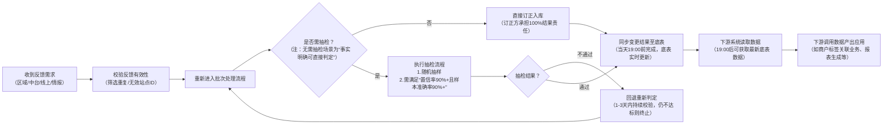

### 一、核心流程与变更前提

#### 1. 标签签设的维护主体是谁？核心维护目标是什么？

- 答：维护主体为**商户运营**；核心维护目标是确保标签的**准确率**与**覆盖率**。

#### 2. 启动标签变更的前提是什么？

- 答：仅当标签对应的**客观事实发生根本性变化**时，才会启动变更流程，非客观事实变化不触发变更。

#### 3. 区域反馈的标签变更，多久能完成 “是否变更” 的初步判断？

- 答：接收区域反馈需求后，会在**T+1 时间内**完成 “标签结果是否需变更” 的初步判断。

### 二、需求来源与优先级

#### 4. 标签变更的需求来源有哪些？是否有优先级排序？

- 答：需求来源共 4 类，优先级按 “**证据链置信度优先**” 原则排序：

1. 区域反馈（优先级最高，基于一线实际场景反馈）；

2. 中台验证（中台自主核验发现的事实变化）；

3. 线上反馈（线上渠道收集的需求）；

4. 情报收集（优先级最低，来源为外部行业信息、竞品数据）。

#### 5. “情报收集” 的具体信息来源是什么？

- 答：仅包括**外部行业信息**与**竞品数据**，不涉及内部系统经营数据。

### 三、校验机制与批次处理

#### 6. 标签变更的 “批次准确率” 需满足什么条件才能放行？未达标如何处理？

- 答：所有待变更站点 ID 按 “批次” 进入反馈待校验池，仅当该批次**准确率＞90%** 时，才会放行并落地变更；

若未达标：会在**1-3 天内持续校验**，仍未满足 90% 则触发 “回退重新判定”，不强制推进变更。

#### 7. “批量处理” 和 “单站处理” 对变更结果有影响吗？

- 答：不直接影响变更结果，仅影响 “批次准确率” 计算 —— 批量处理样本量较大、单站处理样本量较小，两者样本量差异可能导致准确率数值波动，但判定标准（＞90%）一致。

#### 8. 人工校验的具体规则是什么？和机制校验如何配合？

- 答：人工校验本质是**批次质量控制的抽检机制**：

- 方式：对批次内站点 ID 随机抽样；
- 方法:人工 APP 比对,是否存在重叠站,原则上,重叠站验证准确率是 98%+(因为只需要证实)
	- 比对方法 1,列表页展示,同名/同营业执照主体的供给
	- 比对方法 2,团油 APP 加油地图 区域展示有供给且展示价格

- 要求：需同时满足 “置信率 90%+” 和 “样本准确率 90%+”；

- 配合逻辑：人工校验聚焦 “事实真实性复核”，机制校验辅助筛选基础数据，两者协同保障批次质量。

#### 9. 什么是 “订正流程”？责任方是谁？

- 答：订正流程是未达标批次的 “兜底逻辑”—— 若部分站点 ID 无需校验即可明确事实变化（如已确认的客观事实），可直接走订正流程入库；

责任方：**订正方对最终变更结果承担 100% 责任**，需确保订正内容与客观事实一致。

### 四、协同机制与追溯

#### 10. 标签变更的协同流程是怎样的？涉及哪些工具 / 角色？

- 答：全流程协同路径：

**区域反馈→Cooper（需求承接平台）→中台读取 Cooper 数据→人工抽检校验（90%+ 置信率 & 准确率）+ 机制基础校验→结果清晰化→落地变更 / 回退订正**。

#### 11. 标签变更落地后，能否追溯变更记录？如何追溯？

- 答：可以追溯，所有变更记录均存储于**底表数据**中，相关角色（如区域反馈方、中台运营）可通过底表查询具体变更结果（如是否落地变更结果）。

#### 12. 标签变更结果确认后，写到底表及下游读取的流程是怎样的？

- 答：流程如下：

1. 确认标签需变更且完成校验后，变更结果会在**当天晚上 7 点前**写入底表数据；

2. 底表数据会随变更结果实时更新（即写入后底表状态实时变化）；

3. 下游系统 / 角色可在**当天晚上 7 点后**，读取到底表中最新的标签变更结果。

我会先排查Mermaid语法兼容性问题（如换行符、符号格式），重组为更通用的流程图代码（用`\n`替代可能引发兼容问题的` `，优化节点符号排版），确保在主流Markdown编辑器（Typora、语雀、飞书文档）中均可正常渲染：

### 代码修复说明（解决生效失败问题）：
1. **换行符优化**：将原代码中的` `替换为Mermaid更兼容的`\n`，避免部分编辑器（如飞书文档）对HTML标签解析异常；
2. **节点内容拆分**：将节点F中“分点说明”拆为两行（用`\n`分隔），减少单行内容长度，避免解析时因字符密度过高报错；
3. **符号统一**：确保所有括号（`()`）、引号（`""`）均为英文半角符号，避免中文全角符号导致语法识别失败；
4. **循环逻辑确认**：保留H→C的循环链路，补充节点标注清晰度，同时确保箭头连接无语法断层。

### 验证生效的操作建议：
1. 若使用本地编辑器（如Typora）：直接复制代码到文档中，开启“实时预览”即可查看流程图；
2. 若在线编辑（如语雀/飞书）：在“插入”菜单选择“Mermaid图表”，粘贴代码后点击“确认”；
3. 若仍有问题：可复制代码到[Mermaid在线编辑器](https://mermaid-js.github.io/mermaid-live-editor/)（官方工具），验证是否能正常渲染，排查是否为本地编辑器兼容问题。

如果修复后仍无法生效，可告知你使用的具体编辑器（如“飞书文档”“Notion”），我会进一步适配该平台的语法规则！