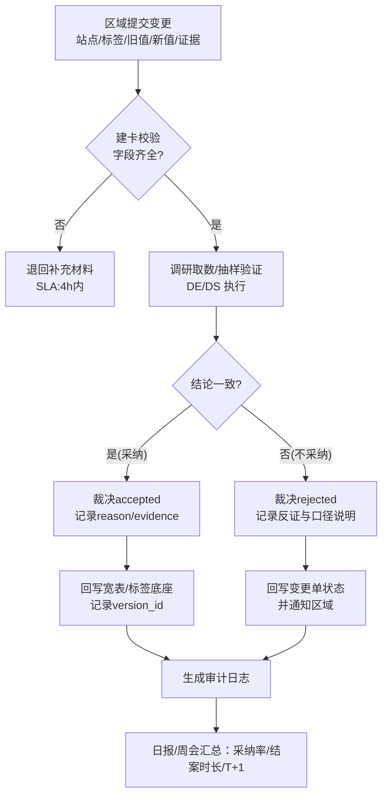
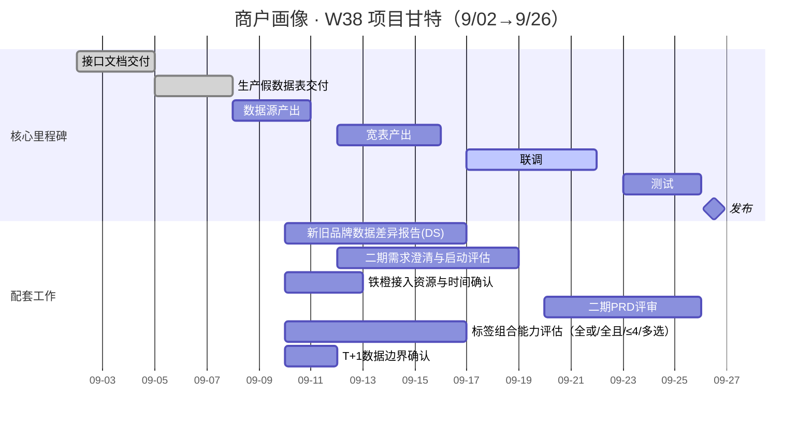

---

project: 商户画像 · W38
owner: 王超宇
period: 2025-09-02 → 2025-09-26
AccTarget: 0.85
CovTarget: 0.90
Fresh: T+1
StableTarget: 0.98

---
# 商户画像 · 周会 Owner 速览（一页纸 W38）


**一句话结论**：按 9/02→9/26 时间轴推进。本周需在**标签组合范围、T+1 边界、铁橙投人、DS 差异影响、二期评审节奏**上现场拍板，确保 9/26 发版不滑。

## 1) 北极星与本周目标

* 北极星：P0=13 标签按期上线并可用（Acc≥0.85，Cov≥0.90，Fresh=**T+1**，Stable≥0.98）。
* 本周目标：完成联调准备 & 口径拍板 → 锁定 **9/23–9/26** 测试准入与回滚阈值。


## 2) 业务进展同步（上周）

**A. 区域变更处理（重叠标签）**

* 已集中处理一批“区域上报→产生重叠”的变更；复盘发现缺少标准化的**调研→裁决→回写**闭环。
* 两向证明：

  1. **采纳**：证明“与区域结论一致且对全局口径无副作用”。
  2. **不采纳**：回传“反证依据与口径解释”，避免二次上报。

**B. 品牌全量清洗（已出文档）**

* 完成一轮“品牌标准化清洗”，形成《清洗说明》。
* 与 **DS**对齐**线上化/管道化**：Fresh=**T+1**；行数守恒（输入=输出）；Acc≥0.85，Cov≥0.90；可回溯与日志留存。

---

## 3) 变更调研-采信-反馈机制 · MVP（进会拍板）

**一句话设计**：先上**流程+SLA**（离线/轻系统均可），9/26 前跑通；10 月做系统化沉淀（表结构 + 审计日志 + UI）。

**RACI**

* **R**：产品（建卡/裁决流程）、数据DE（取数与验证作业）、DS（抽检与证据）、区域（提交证据）
* **A**：Owner（你）
* **C**：前后端（字段与回写接口）
* **I**：铁橙接口人

**MVP 验收口径**

* TTR（平均结案时长）≤ **3 工作日**；采纳/不采纳均有证据链接；回写成功率 ≥ **99%**；变更单**行级可追溯**（旧/新值、证据、裁决人、时间、version）。

**会议拍板**

1. **SLA**：提交→立案≤4h；调研≤48h；裁决≤24h；回写≤4h。
2. **证据清单模板**：站点ID/标签/旧值/新值/截图或SQL/外采来源。
3. **回写字段**：`change_request_id`、`decision`（accepted/rejected）、`reason_code`、`evidence_link`、`decided_by`、`decided_at`、`version_id`。

### 3.1 Mermaid 流程图（调研-采信-反馈）



---

## 4) 项目推进时间轴（甘特图）



---

## 5) 进度看盘（RAG）

* 里程碑：🟩 接口/假数据；🟨 数据源/宽表；🟨 联调准备；🟨 二期评审锁期。
* 质量四指标口径：Acc（抽检通过率）｜Cov（P0=13 覆盖）｜Fresh=**T+1**｜Stable（7日成功率）。
* 会上只报**红/黄 + 差分**，绿色不展开。

---

## 6) 当场需拍板的 5 件事（每条≤6’）

1. **标签组合能力范围**：全或/全且、≤4 标签、标签内多选——本期“全量/阉割”结论与替代口径。
2. **T+1 边界**：是否存在必须实时的白名单场景；如有，列清单与延后策略。
3. **铁橙接入**：接口清单、字段映射、样例、投人时间；若不纳入，给下次评审点。
4. **DS 差异报告影响**：是否改变上线口径；如影响，给“双轨方案（替代口径 vs 不变发布）”。
5. **二期 PRD 评审节奏**：评审日期/评审人锁定；通过即入 10 月版本列车。

> 拍板格式统一：结论｜Owner｜DDL｜验收口径（表/脚本/阈值）｜风险\&Plan B。

---

## 7) 本周行动清单（Tasks，可勾选）

* [x] T01 接口文档交付 @Trunks Sun 📅 2025-09-05
* [x] T02 生产假数据表交付 @Trunks Sun 📅 2025-09-08
* [x] T03 数据源产出 @Hubert Hu 📅 2025-09-11 ✅ 2025-09-18
* [x] T05 宽表产出 @Hubert Hu 📅 2025-09-16 ✅ 2025-09-18
* [x] T06 联调 @前端/后端/DE/DS 📅 2025-09-22 ✅ 2025-09-24
* [ ] T07 测试 @QA/研发/产品 📅 2025-09-26
* [ ] T08 发布 @全体 📅 2025-09-26
* [x] T09 新旧品牌差异报告 @DS团队 📅 2025-09-17 ✅ 2025-09-18
* [x] T10 二期需求澄清与启动评估 @超宇/君婷 📅 2025-09-19 ✅ 2025-09-24
* [x] T11 铁橙接入资源与时间确认 @超宇/刁刁/胜琦 📅 2025-09-13 ✅ 2025-09-18
* [ ] T12 二期 PRD 评审 @产品 📅 2025-09-26
* [x] T13 标签组合能力评估（全或/全且/≤4/多选） @数链/前端 📅 2025-09-17 ✅ 2025-09-18
* [x] T14 T+1 数据边界确认 @DE/后端/产品 📅 2025-09-12 ✅ 2025-09-18

### 7.1 任务看板（Dataview：本页未完成任务）

```dataview
TASK
FROM ""
WHERE file.path = this.file.path AND !completed
SORT due ASC
```

---

## 8) 准入与回滚（测试/发布）

* **准入**：Acc≥0.85｜Cov≥0.90｜Fresh=**T+1** 达标｜阻塞类缺陷=0。
* **回滚**：任务失败率>2% 连续两批；关键指标跌破阈值且2小时内不可恢复；数据口径错误影响>5% 站点。

---

## 9) 待线下再对齐（Parking Lot）

| 议题 | 需到会人 | 约会时间 | 预期产出 |
| -- | ---- | ---- | ---- |
|    |      |      |      |

---
研发:进入联调了,跟正双口径没有拉齐,会下可以拉齐.
前端:页面方式
DE:业务数据真实数据要提前进来,9/23-14 点(王超宇提供)


---

## 附：问题卡模板（复制后改值即可）

```markdown
**问题卡：<标题>**
- 现象（数据/证据）：
- 主因（唯一）：
- 方案A / 方案B：
- 需要谁在何时做什么：
- DDL：
- 验收口径（样例/阈值/表名/脚本）：
- 备注/风险（Plan B）：
```
