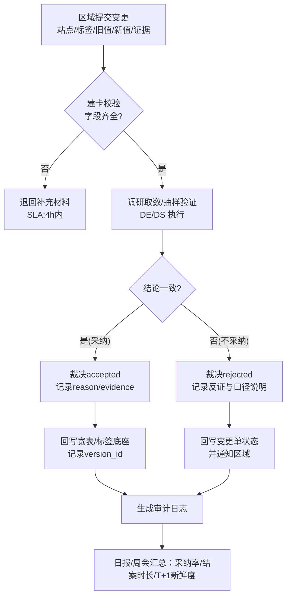
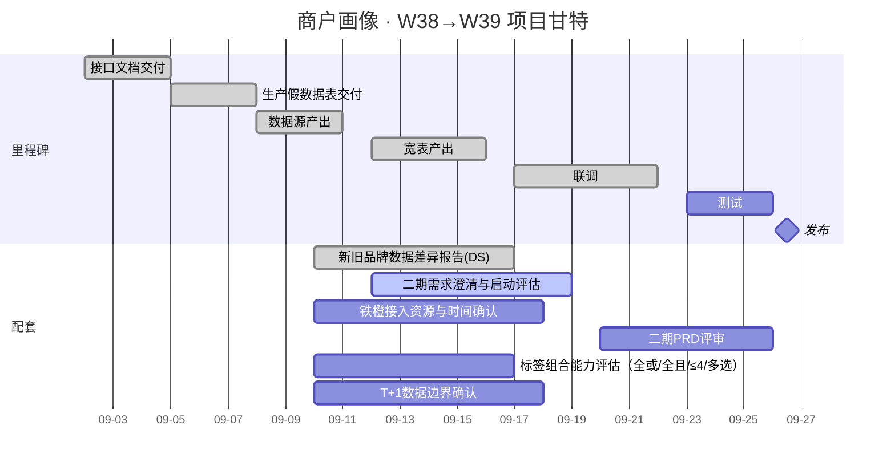

---

---

创建 / 更新日期: 2025-09-24

版本号: 1.0.0

状态：非定稿

标签: [会议纪要，项目周会，数据项目，OB 模板，待办管理]

---

# 商户画像周会纪要（2025-09-24）

## 一、会议核心信息

|          |                                                                   |
| -------- | ----------------------------------------------------------------- |
| 要素分类     | 具体内容                                                              |
| **会议主题** | 第 1 期进度 对齐・2期需求预热                                                 |
| **会议时间** | 2025 年 09 月 24 日 14:00-15:00                                      |
| **会议形式** | 线下（自我进化会议室）+ 线上                                                   |
| **主持人**  | 王超宇                                                               |
| **参会人员** | 姜宇立、胡正双、孙杨帆、刘力瑒、王君婷、刘沙沙、李加华、戴源成、刘胜琦、郑志翔、孙华北                       |

## 二、核心讨论与决议

### 2.1 上周 Todo 进度复盘

1. **讨论事项**：一是数据源手工导入过程中存在风险，具体表现为日期格式不统一（如带杠与斜杠混用）；二是在**新站入驻流程改造方案_新增标签内容填写**的方案调研工作需要给更详细的结论，需进一步确认该任务的优先级和交付产出；。

2. **分歧点**：数据源清洗前是否需先统一格式标准，过去尚未形成一致结论。方案调研任务原定为 P1 优先级，产品对是否需提升优先级以保障二期需求推进存在不同意见；

3. **会议共识**：一是数据源需按 Raw Hive 表格式完成清洗后再交付，若出现异常数据由业务岗负责修复，数据岗需同步提供问题数据示例（Badcase）；二是标签调研优先级提升至 P0，纳入二期需求范畴，由产品岗输出包含页面原型、校验逻辑的改造方案；

### 2.2 二期需求预热（BRD）

1. **讨论事项**：重点围绕二期需求范围展开讨论，一是建议确定二期核心指标为准确率、覆盖率、及时率、波动率四项；二是提出新增数据源线上化校验功能，以降低格式风险；三是需将需求开BRD 评审会把需求明确成明文共识。

2. **会议共识**：最终明确共识，是 9 月 27 日由业务与产品共同组织 BRD 评审会。

### 2.3 上线标签数据源与标签规则

1. **讨论事项**：一是部分标签存在无数据的情况，需明确兜底处理方案；二是营业时间数据需在前端展示，需约定统一的接口 Key 值；三是测试用例未覆盖无数据兜底场景，需补充更新。同时需明确宽表数据不足时的前端展示规则

2. **分歧点**：一为无数据时的兜底规则不明确，对 “是否统一按默认值处理” 未明确公示；其二为营业时间接口 Key 值未统一，尚未确定固定标识。

3. **会议共识**：一是无数据标签统一按默认值兜底，兜底逻辑参见标签字典；二是 9 月 25 日前由技术共同确定铁橙 APP 的数据，明确营业时间的固定 Key 值；三是测试需根据《标签默认值清单》更新测试用例，覆盖兜底场景并同步至测试。上线数据以dt=2025-09-25为节点，宽表数据不足时前端隐藏超周期的对比示例；

### 2.4 铁橙 APP开发排期与风险预警

1. **讨论事项**：围绕开发进度与风险防控展开，一是确定开发排期为 “节前完成开发，节后最晚 10 月 13 日上线”；二是需建立定期进度同步机制，及时识别风险；三是需协调资源以支撑开发与测试工作，避免资源缺口影响进度。

2. **会议共识**：一是从 9 月 25 日起，假设有异常和风险，同步产品和业务；二是需在 9 月 28 日前梳理现有资源，明确资源缺口并协调补充(如果是没有测试资源要明确给结论)。

## 三、待办任务

|              |                                      |           |            |                     |     |
| ------------ | ------------------------------------ | --------- | ---------- | ------------------- | --- |
| 待办 ID        | 任务内容                                 | 负责人       | 完成时限       | 依赖条件 / 交付物          | 优先级 |
| T20250924-01 | **新站入驻流程改造方案_新增标签内容填写**方案调研          | 王君婷       | 2025-09-28 | 交付物：结论+成本预估+可能的卡点   | P0  |
| T20250924-02 | 组织 BRD 评审会，评审二期需求范围                  | 王超宇 王君婷   | 2025-09-26 | 交付物：BRD 评审会议纪要      | P1  |
| T20250924-03 | 确定《非标签数据接口规范》（含营业时间固定 Key 值）         | 技术        | 2025-09-25 | 交付物：接口规范文档；关联：前端岗开发 | P0  |
| T20250924-04 | 根据《标签默认值清单》更新测试用例，覆盖兜底场景             | 邵同利       | 2025-09-26 | 确保符合预期              | P0  |
| T20250924-05 | 按 “上线数据以 dt=2025-09-25 为节点做展示,之前的不展示 | 孙华北       | 2025-09-25 | 确保符合预期              | P0  |
| T20250924-06 | 铁橙 APP 的数据链路回传到数仓的链路调研               | 王君婷/杨帆/正双 | 2025-09-28 | 取和存的数据字段,链路/格式等     | P0  |
|              |                                      |           |            |                     |     |

---

![[PixPin_2025-09-24_14-46-17.png]]

---

## 6) 变更调研-采信-反馈 · Mermaid 流程

---

## 7) 甘特图（9/02→9/26）

---

