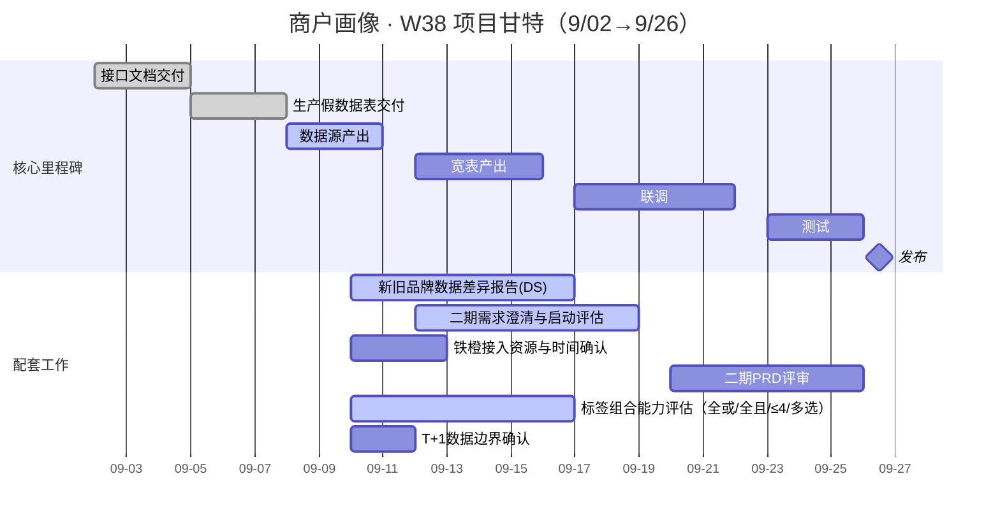

# 商户画像 · 周会项目页（W38）

## 1) 甘特图



---

## 2) 指标（本周口径）

* Acc:: 0.85（抽检通过率）
* Cov:: 0.90（P0=13 覆盖率）
* Fresh:: **T+1**（落表时效）
* Stable:: 0.98（近7日成功率）

> 会上只报红/黄项与差分：Acc△、Cov△、Fresh是否满足T+1、失败重跑率。

## 3) 行动清单（Tasks 语法，自动可视化）

* [x] T01 接口文档交付 @Trunks Sun 📅 2025-09-05 ✅ ✅ 2025-09-17
* [x] T02 生产假数据表交付 @Trunks Sun 📅 2025-09-08 ✅ ✅ 2025-09-17
* [x] T03 数据源产出 @Hubert Hu 📅 2025-09-11 ✅ 2025-09-17
* [x] T05 宽表产出 @Hubert Hu 📅 2025-09-16 ✅ 2025-09-17
* [x] T06 联调 @前端/后端/DE/DS 📅 2025-09-22 ✅ 2025-09-24
* [ ] T07 测试 @QA/研发/产品 📅 2025-09-26
* [ ] T08 发布 @全体 📅 2025-09-26
* [x] T09 新旧品牌差异报告 @DS团队 📅 2025-09-17 ✅ 2025-09-18
* [x] T10 二期需求澄清与启动评估 @超宇/君婷 📅 2025-09-19 ✅ 2025-09-24
* [x] T11 铁橙接入资源与时间确认 @超宇/刁刁/胜琦 📅 2025-09-13 ✅ 2025-09-18
* [ ] T12 二期 PRD 评审 @产品 📅 2025-09-26
* [x] T13 标签组合能力评估（全或/全且/≤4/多选） @数链/前端 📅 2025-09-17 ✅ 2025-09-18
* [x] T14 T+1 数据边界确认 @DE/后端/产品 📅 2025-09-12 ✅ 2025-09-18

### 任务看板（Dataview：本页未完成任务）

```dataview
TASK
FROM ""
WHERE file.path = this.file.path AND !completed
SORT due ASC
```

## 4) 待解决事项

* \-

## 5) 关键决策记录（口径/阈值/版本）
