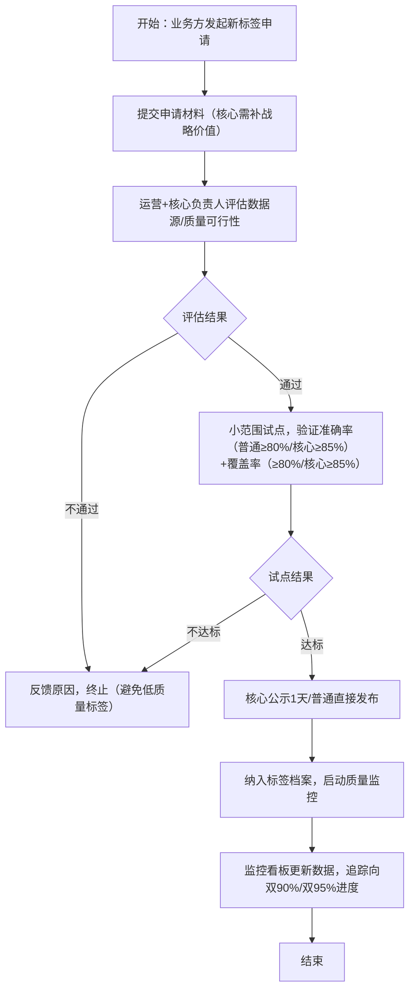
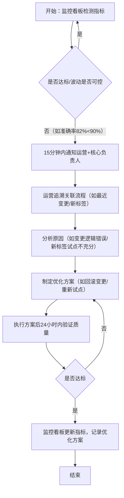

# 业务需求文档 (BRD) v3.0
> **项目**: 标签生命周期管理平台  
> **版本**: v1.0  
> **状态**: draft  
> **创建时间**: 2025-09-28  
> **负责人**: 王超宇  

## 📋 文档概述
聚焦**标签生命周期管理平台**的核心业务需求——以“实现标签质量达标”为唯一核心目标，即**普通标签准确率≥90%、覆盖率≥90%;核心标签准确率≥95%、覆盖率≥95%** ；同时辅助说明当前为追求该目标所消耗的资源现状（如高人力投入），以及平台通过流程化、标准化管理，在达成质量目标的同时，自然实现“降本增效”的业务逻辑（具体落地细节由产品PRD承接）。

## 1. 项目背景与目标（核心聚焦质量目标，辅助说明资源与效益）
### 1.1 业务背景（痛点：为追质量，资源消耗过高）
- **现状描述**：当前13个P0标签（含核心标签）的核心管理目标是“提升质量至双90%/双95%”，但因缺乏系统化工具，完全依赖运营人工维护标签字典、反复核对数据、线下处理质量问题——为接近目标（当前准确率基线85%），运营需投入30%人力用于“手工校验标签准确性、补全覆盖缺口、追溯质量问题”，且无标准化流程导致质量波动大（周准确率波动超10%），投入产出比低。  
- **核心痛点（与质量目标强关联）**：  
  1. 质量管控低效：标签字典依赖线下手工誊写,靠人工抽查标签字典统计准确率/覆盖率，问题发现滞后（平均2天），错过修正最佳时机，影响目标达成；  
  2. 资源消耗过高：30%运营人力陷入“重复核对、手工补数”的低价值工作，无法聚焦质量优化核心动作；  
  3. 流程无序影响质量：新标签准入无试点验证、标签变更无影响评估，易引入低质量数据，拖慢质量达标进度；  
  4. 质量波动无监控：缺乏对准确率/覆盖率波动率的管控，即使短期接近目标，也难以稳定维持。  
- **业务影响**：高资源投入下，质量目标仍难以突破（准确率卡在85%、覆盖率不足80%），核心标签因管控更复杂，质量达标难度更高，直接影响下游业务决策（如商户分层、营销策略）的准确性。

### 1.2 项目目标（唯一核心：质量达标；辅助：资源优化）
- **唯一核心目标**：  
  1. 短期（1.5个月，基础铺垫）：建立“流程化管控+多维度监控”机制，解决“人工操作影响质量”的问题，为质量达标打基础；  
  2. 中期（3个月，核心达标）：实现**普通标签准确率≥90%、覆盖率≥90%** ，**核心标签准确率≥95%、覆盖率≥95%** ，且质量周波动率≤5%（核心标签≤3%），稳定维持目标；  
  3. 长期（6个月，持续稳定）：建立可复用的质量管控模式，保障标签质量长期达标，无需额外增加人力投入。  

- **资源消耗现状与项目后效益（辅助说明）**：  

| 维度     | 当前现状（为追质量的资源消耗）    | 项目后状态（达标质量时的效益） | 逻辑关联                 |
| ------ | ------------------ | --------------- | -------------------- |
| 人力投入   | 运营 30% 精力用于手工校验、补数 | 运营人力投入降至 15% 以下 | 流程化替代手工操作，减少低价值工作    |
| 问题处理周期 | 质量问题平均 3 天发现 + 解决  | 问题 1 天内响应 + 处理  | 监控看板实时告警，缩短修正周期      |
| 变更效率   | 标签变更靠手工改字典，周期 3 天  | 变更流程化，周期≤1 天    | 标准化审批减少沟通成本，避免变更影响质量 |
- **成功标准**：  
  - 核心：普通标签双90%、核心标签双95%，且周波动率≤5%（核心≤3%），连续2周稳定达标；  
  - 辅助：运营人力投入≤15%，质量问题处理周期≤1天（验证“达标质量时，资源消耗降低、效率提升”）。

### 1.3 项目价值（核心：保障质量；附加：降本增效）
- **核心价值（质量层面）**：  
  - 业务决策有可靠数据支撑：标签准确率/覆盖率达标，下游业务（如商户分层）无需额外校验数据，决策效率提升；  
  - 核心标签风险可控：核心标签双95%目标达成，避免因核心数据错误导致的战略级业务损失。  
- **附加价值（降本增效层面，自然结果）**：  
  - 降本：运营人力从30%降至15%，减少15%的人力成本投入；  
  - 增效：质量问题发现时效提升60%，变更处理效率提升67%，资源聚焦高价值的质量优化动作。

## 2. 项目范围与边界（所有范围围绕“支撑质量目标”）
### 2.1 项目范围（优先级：直接影响质量达标的模块优先）
#### 包含范围（所有抓手均为“达成双90%/双95%”服务）
| 优先级 | 业务需求 | 对应抓手（功能模块） | 对质量目标的支撑作用 | 辅助效益（降本增效） |
|--------|----------|----------------------|----------------------|----------------------|
| P0（必做） | 新标签准入流程化 | 流程引擎（准入流程） | 试点验证新标签质量（普通≥80%/核心≥85%），避免低质量标签进入 | 减少后续“手工剔除低质量标签”的人力投入 |
| P0（必做） | 标签变更流程化 | 流程引擎（变更流程） | 评估变更对质量的影响，避免变更引入新错误 | 变更周期从3天→1天，提升效率 |
| P0（必做） | 标签下线流程化 | 流程引擎（下线流程） | 避免误下线导致覆盖率下降，保障覆盖目标 | 减少“误下线后补数据”的重复工作 |
| P0（必做） | 标签字典系统化 | 标签档案模块 | 统一数据底座，为质量统计提供准确基础 | 替代手工查字典，减少30%核对时间 |
| P0（必做） | 质量+波动监控 | 质量监控（综合看板） | 实时追踪准确率/覆盖率，波动超阈值及时干预 | 质量问题发现从3天→15分钟，降低修正成本 |
| P1（跟进） | 标准取数服务 | 数据服务（标准取数） | 统一数据口径，避免业务方用数错误反向影响质量评估 | 业务方取数效率提升60%，减少对账人力 |

#### 排除范围（不影响质量目标的模块不纳入）
- 非P0标签的管理（不影响核心质量目标达成）；  
- 标签算法优化与模型训练（属数据团队职责，平台仅提供质量反馈，不直接参与质量提升）；  
- 流程化节点的具体交互设计（如页面布局，由产品PRD定义，不影响流程对质量的管控作用）；  
- 非质量相关的监控指标（如平台访问量，与双90%/双95%目标无关）。

### 2.2 用户群体（所有角色围绕“助力质量达标”）
| 用户角色       | 用户特征            | 核心业务需求（服务于质量目标）                | 对应抓手（功能/能力）         | 关注重点               |
| ---------- | --------------- | ------------------------------ | ------------------- | ------------------ |
| 标签运营       | 负责P0标签质量优化、日常管控 | 1. 流程化避免操作影响质量；2. 监控质量波动，及时修正  | 三节点流程、质量监控看板        | 准确率/覆盖率是否达标，波动是否可控 |
| 核心标签负责人    | 管控核心标签质量（双95%）  | 1. 审批核心标签流程，把控质量入口；2. 监控核心标签波动 | 核心标签审批、监控看板（核心专属视图） | 核心标签双95%是否达标，波动≤3% |
| 业务方（策略/运营） | 使用标签数据，反馈质量问题   | 1. 反馈标签质量问题（如准确率错误）；2. 获取达标数据  | 质量问题反馈入口、标准取数       | 数据是否准确，覆盖是否完整      |
| 平台管理员      | 配置质量管控规则        | 1. 设定质量波动阈值；2. 配置流程质量卡点        | 监控规则配置、流程配置         | 监控是否有效，流程是否能保障质量   |

### 2.3 业务边界（围绕“质量达标”的业务起止）
- **业务起点**：13个P0标签（含核心标签）的人工标签字典梳理，明确当前质量基线（准确率85%、覆盖率不足80%）；  
- **业务终点**：普通标签双90%、核心标签双95%稳定达标，且建立持续监控机制；  
- **接口边界**：  
  - 上游：从商户数据系统获取标签原始数据，支撑质量计算（如准确率=正确标签数/总标签数）；  
  - 下游：向业务系统提供达标标签数据（避免未达标数据影响业务）；  
  - 内部：与企业权限体系对接，核心标签质量管控权限专属（保障核心质量）。

## 3. 核心业务需求与对应抓手（所有需求指向“质量达标”）
### 3.1 P0需求：流程化管控（避免人工操作拖慢质量达标）
#### 3.1.1 需求1：新标签准入流程化（P0级，控制质量入口）
- **业务痛点**：当前新标签无试点验证，直接上线易引入低质量数据（如准确率不足70%），拖慢整体质量达标进度；  
- **对应抓手**：流程引擎（新标签准入流程）；  
- **流程化要求（服务于质量目标）**：  
  1. **申请阶段**：业务方需提交“新标签业务价值、计算逻辑、数据源”，核心标签额外说明“对战略业务的影响”（避免无价值标签占用质量优化资源）；  
  2. **评估阶段**：运营+核心标签负责人评估“数据源可靠性、质量达标可行性”，不通过则驳回（避免源头质量风险）；  
  3. **试点阶段**：评估通过后，小范围（10%目标商户）试点，验证“准确率≥80%（核心≥85%）、覆盖率≥80%（核心≥85%）”（上线最低质量门槛，避免拉低整体质量）；  
  4. **发布阶段**：试点达标后纳入标签档案，同步启动质量监控；核心标签需额外公示1天，收集业务方质量反馈。  
- **辅助效益**：避免后续“手工清理低质量新标签”的人力投入，减少30%无效工作量。

#### 3.1.2 需求2：标签变更流程化（P0级，避免变更影响质量）
- **业务痛点**：当前标签变更靠手工改字典，无影响评估，易导致“变更后准确率下降5%-10%”，需运营额外投入人力核对修正；  
- **对应抓手**：流程引擎（标签变更流程）；  
- **流程化要求（服务于质量目标）**：  
  1. **申请阶段**：运营需填写“变更原因、变更内容、对准确率/覆盖率的影响预估”，核心标签需附加“风险应对方案”；  
  2. **审批阶段**：普通标签1级审批（评估影响）、核心标签2级审批（额外确认风险），审批不通过需调整方案；  
  3. **执行阶段**：审批通过后，运营执行变更，系统自动记录变更前后对比；  
  4. **验证阶段**：变更后24小时内抽样验证（普通标签≥500条、核心≥800条），确保准确率/覆盖率无下降（如核心标签准确率仍≥95%）。  
- **辅助效益**：变更处理周期从3天→1天，减少运营“变更后反复核对”的人力投入。

#### 3.1.3 需求3：标签下线流程化（P0级，保障覆盖率目标）
- **业务痛点**：当前标签下线靠临时通知，易误下线有效标签，导致覆盖率下降（如误下线后覆盖率降低3%-5%），需额外补数；  
- **对应抓手**：流程引擎（标签下线流程）；  
- **流程化要求（服务于质量目标）**：  
  1. **申请阶段**：运营需说明“下线原因、涉及商户范围、对覆盖率的影响”，确保下线不影响整体覆盖目标；  
  2. **评估阶段**：核心标签需业务负责人评估“下线对业务的影响”，普通标签由运营评估；  
  3. **公示阶段**：评估通过后公示3天（核心5天），收集业务方反馈，避免误下线；  
  4. **停用阶段**：公示无异议后标记“下线”，保留历史数据（避免覆盖缺口）。  
- **辅助效益**：减少“误下线后补数据”的重复工作，节省15%运营人力。

#### 3.1.4 需求4：标签字典系统化（P0级，为质量统计打基础）
- **业务痛点**：人工标签字典分散、信息不全，无法准确统计准确率/覆盖率，影响质量目标评估；  
- **对应抓手**：标签档案模块；  
- **核心需求（服务于质量目标）**：  
  1. 整合13个P0标签（含核心）的基础信息（名称、定义、计算逻辑、负责人），确保质量统计口径统一；  
  2. 自动关联“准入/变更/下线”流程记录+质量数据（如某标签变更后准确率从88%→92%），支持质量追溯；  
  3. 核心标签单独标注，支持按“质量达标状态（已达标/未达标）”筛选，方便运营聚焦未达标标签优化。

### 3.2 P0需求：多维度监控（保障质量达标与稳定）
#### 3.2.1 需求：质量+波动监控（P0级，实时追踪质量目标）
- **业务痛点**：当前靠人工抽查统计质量，无法实时知道“距离双90%/双95%还差多少”，波动超阈值也无法及时干预；  
- **对应抓手**：质量监控（综合看板）；  
- **监控要求（服务于质量目标）**：  
  1. **核心质量指标（实时追踪达标进度）**：  
     - 准确率：展示普通标签（当前值/目标90%）、核心标签（当前值/目标95%），按日更新，未达标标黄、达标标绿；  
     - 覆盖率：展示普通标签（当前值/目标90%）、核心标签（当前值/目标95%），按周更新；  
  2. **质量稳定性指标（保障目标稳定）**：  
     - 波动率：展示“准确率周波动率（普通≤5%/核心≤3%）、覆盖率周波动率（普通≤5%/核心≤3%）”，超阈值自动标红；  
  3. **告警机制（及时修正偏差）**：指标超阈值（如准确率低于85%、波动率超5%）时，15分钟内通知运营+核心标签负责人，避免偏离目标过远。  
- **辅助效益**：质量问题发现从3天→15分钟，减少因问题累积导致的“大规模修正”人力投入。

## 4. 业务流程（围绕“质量达标”设计）
### 4.1 核心业务流程1：新标签准入流程（控制质量入口）

### 4.2 核心业务流程2：质量异常处理流程（保障目标不偏离）

## 5. 验收标准（核心：质量达标；辅助：资源效益）
### 5.1 核心验收标准（质量目标是否达成）
- [ ] **质量达标**：普通标签准确率≥90%、覆盖率≥90%，核心标签准确率≥95%、覆盖率≥95%，且连续2周稳定（周波动率≤5%/核心≤3%）；  
- [ ] **流程保障**：P0三节点（准入/变更/下线）流程化率100%，新标签试点达标率100%（无低质量标签上线）；  
- [ ] **监控有效**：质量监控看板可实时展示准确率/覆盖率/波动率，指标超阈值15分钟内告警，告警响应率100%。

### 5.2 辅助验收标准（资源效益是否实现，验证“达标质量时的附加价值”）
- [ ] **人力降本**：运营在标签管理上的人力投入≤15%（从30%下降）；  
- [ ] **效率提升**：质量问题处理周期≤1天（从3天下降），标签变更周期≤1天（从3天下降）；  
- [ ] **用户认可**：运营、核心标签负责人、业务方对“质量达标效果”的满意度≥80分。

## 6. 风险与假设（围绕“质量达标”的风险）
### 6.1 主要业务风险（影响质量目标达成的因素）
| 风险描述 | 影响程度 | 发生概率 | 应对措施 | 负责角色 |
|----------|----------|----------|----------|----------|
| 人工标签字典数据错误，导致质量基线统计不准 | 高 | 中 | 提前2周梳理字典，运营+核心标签负责人联合校验，确保基线准确（避免目标设定偏差） | 王超宇（统筹）、运营 |
| 数据源波动导致质量反复（如准确率从91%→86%） | 高 | 中 | 监控看板新增“数据源波动预警”，提前储备2个备选数据源，波动时快速切换 | 运营、数据团队 |
| 核心标签审批人超时，延误质量优化进度 | 中 | 高 | 为核心标签审批设置“24小时响应”机制，超时自动升级提醒，避免流程停滞 | 平台管理员、核心标签负责人 |

### 6.2 关键业务假设（质量目标达成的前提）
- **业务假设**：  
  1. 标签数据源（商户数据系统）每月波动≤8%，可支撑“波动率≤5%”的稳定要求；  
  2. 运营、核心标签负责人可配合投入时间（每周≥4小时）参与流程测试与质量优化；  
  3. 新标签准入、变更流程化后，无人工绕过系统操作（避免低质量数据流入）。  
- **资源假设**：  
  1. 数据团队可配合提供“准确率/覆盖率计算逻辑”，支撑监控看板开发；  
  2. 运营团队可投入1人全职梳理标签字典与质量问题反馈。

## 7. 成功指标（核心：质量；辅助：资源效益）
| 指标类型 | 指标名称 | 当前基线 | 目标值 | 测量方式 | 责任人 | 测量频率 |
|----------|----------|----------|--------|----------|--------|----------|
| **核心质量指标** | 普通标签准确率 | 85% | ≥90% | 每月抽样核对（样本≥1000条） | 数据质量团队 | 每月 |
| **核心质量指标** | 普通标签覆盖率 | <80% | ≥90% | 系统统计覆盖商户占比 | 运营 | 每周 |
| **核心质量指标** | 核心标签准确率 | 85% | ≥95% | 每月抽样核对（样本≥800条） | 核心标签负责人 | 每月 |
| **核心质量指标** | 核心标签覆盖率 | <80% | ≥95% | 系统统计覆盖商户占比 | 核心标签负责人 | 每周 |
| **核心质量指标** | 质量周波动率 | 10%+ | ≤5%（核心≤3%） | （周最大值-周最小值）/周平均值 | 运营 | 每周 |
| **辅助效益指标** | 运营人力投入占比 | 30% | ≤15% | 运营工时统计（标签管理相关） | 王超宇 | 每周 |
| **辅助效益指标** | 质量问题处理周期 | 3天 | ≤1天 | 统计问题发现到解决的时间 | 运营 | 每日 |

## 8. 附录
### 8.1 术语表（聚焦质量相关定义）
| 术语 | 定义 |
|------|------|
| P0标签 | 业务优先级最高的标签，含“核心标签”与“普通P0标签”，需共同达成质量目标 |
| 核心标签 | P0标签中支撑战略级业务（如商户分层）的标签，质量目标额外提升5%（双95%） |
| 标签字典 | 记录标签基础信息、计算逻辑的文档，原人工维护，现通过标签档案系统化（为质量统计打基础） |
| 质量波动率 | 标签准确率/覆盖率在周期内（周）的波动幅度，计算公式：（最大值-最小值）/平均值，反映质量稳定性 |
| 核心质量目标 | 普通标签准确率≥90%、覆盖率≥90%，核心标签准确率≥95%、覆盖率≥95%（项目唯一核心） |

### 8.2 参考文档
- 《商户画像 1 期 PRD/技术实现方案》  

### 8.3 版本历史
| 版本 | 日期 | 作者 | 变更说明 |
|------|------|------|----------|
| v1.0 | 2025-09-28 | 王超宇 | 初始版本，唯一核心为“普通标签双90%、核心标签双95%”，辅助说明资源消耗与效益 |

### 8.4 审批记录
| 角色 | 姓名 | 日期 | 签名 | 备注 |
|------|------|------|------|------|
| 创建者 | 王超宇 | 2025-09-28 | 待签名 |  |
| 业务审核（核心标签负责人） | - | - | 待审核 | 关注核心标签双95%目标 |
| 业务审核（运营负责人） | - | - | 待审核 | 关注质量达标与人力降本的平衡 |
| 最终批准（业务负责人） | - | - | 待批准 | 关注质量目标对业务的支撑 |

**文档状态**: draft | **最后更新**: 2025-09-28  
*本文档聚焦“质量达标”核心目标，具体功能落地细节由产品PRD承接*